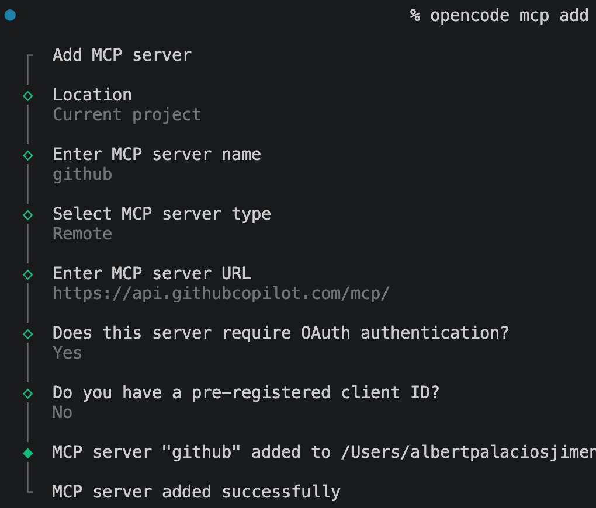

<style> .images { max-width: 400px; border: 1px solid grey; padding: 4px; } </style>

# MCPs

Els **MCPs** (*Model Context Protocol*) són una manera estàndard de connectar un agent d’IA amb eines externes.

Sense MCP, l’agent normalment només pot respondre amb text.

Amb MCP, pot accedir a serveis o eines com:

* Arxius del projecte
* GitHub
* Bases de dades
* APIs externes
* Navegadors
* Eines pròpies creades pel programador

La idea és que l’agent no hagi de saber com funciona internament cada servei. El servidor MCP li ofereix unes eines concretes, i l’agent les pot utilitzar quan les necessita.

Per exemple, amb un **MCP de GitHub**, OpenCode podria demanar informació d’un repositori, llegir issues o preparar una pull request, sempre segons els permisos configurats.

## MCPs vs Tools

* **MCPs**: eines externes exposades mitjançant un protocol estàndard.
* **custom tools**: eines pròpies definides dins d’un entorn concret.

Exemple:

* **MCP de GitHub**: qualsevol client compatible amb MCP el podria fer servir.
* **Custom tool `create_issue`**: una eina feta només per al teu OpenCode o per al teu agent concret.

## MCPs a OpenCode

Els *MCPs* es configuren a través de l'arxiu *opencode.json* a l'arrel del projecte.

Per afegir servidor de MCPs al projecte:

```bash
opencode mcp add
# escollir el nom 'github'
# escollir la ubicació 'remote'
# definir la url 'https://api.githubcopilot.com/mcp/'
# escollir OAuth
# escollir que no tens "pre-registered client ID"
# "Create a new client secret"
# Copiar la clau (no es podrà tornar a fer)
# Update Application
```

<center>
<br/><br/>
</center>

Veurem com a l'arxiu *opencode.json* apareix:

```json
  "mcp": {
    "github": {
      "type": "remote",
      "url": "https://api.githubcopilot.com/mcp/",
      "enabled": true,
      "oauth": false,
      "headers": {
        "Authorization": "Bearer {env:GITHUB_PERSONAL_ACCESS_TOKEN}"
      }
    }
  }
```

Però cal afegir un token d'autorització, es pot obtenir a github:

- Compte personal > Settings
- Developer settings (última opció)
- OAuth apps
- New OAuth app
- Name: OPENCODE_API_KEY, Secret: "escollir una clau segura"


```json
  "mcp": {
    "github": {
      "type": "remote",
      "url": "https://api.githubcopilot.com/mcp/",
      "headers": {
        "Authorization": "Bearer ${GITHUB_TOKEN}"
      }
    }
  }
```

5c9196f3ad0d4c5ca322a76c5cdd09d2419ca86e

Des del mateix OpenCode, podem llistar els *MCPs* disponibles amb:

```text
/mcps
```

## 6. Exemple bàsic d’estructura

```json
{
  "mcp": {
    "nom-del-mcp": {
      "command": "npx",
      "args": [
        "-y",
        "paquet-del-mcp"
      ],
      "env": {
        "TOKEN": "valor"
      }
    }
  }
}
```

## 7. Exemple: MCP de GitHub

```json
{
  "mcp": {
    "github": {
      "command": "npx",
      "args": [
        "-y",
        "@modelcontextprotocol/server-github"
      ],
      "env": {
        "GITHUB_PERSONAL_ACCESS_TOKEN": "ghp_xxxxxxxxxxxxxxxxx"
      }
    }
  }
}
```

## 8. Què pot fer l’agent amb GitHub MCP

* Consultar repositoris
* Llegir issues
* Crear issues
* Consultar pull requests
* Crear pull requests
* Llegir fitxers del repositori
* Fer accions sobre GitHub segons els permisos del token

## 9. Token de GitHub

* Cal crear un **Personal Access Token**
* El token ha de tenir només els permisos necessaris
* Millor no posar-lo directament al JSON
* Recomanable usar variables d’entorn

Exemple millor:

```json
{
  "mcp": {
    "github": {
      "command": "npx",
      "args": [
        "-y",
        "@modelcontextprotocol/server-github"
      ],
      "env": {
        "GITHUB_PERSONAL_ACCESS_TOKEN": "${GITHUB_TOKEN}"
      }
    }
  }
}
```

## 10. Exemple d’ús dins d’OpenCode

* “Llegeix les issues obertes d’aquest repositori”
* “Crea una issue amb aquest error”
* “Revisa aquesta pull request”
* “Crea una pull request amb aquests canvis”
* “Busca els fitxers relacionats amb l’autenticació”

## 11. Permisos i seguretat

* No donar accés global si no cal
* No usar tokens personals amb massa permisos
* No instal·lar MCPs desconeguts
* Revisar què pot fer cada MCP
* Separar tokens per projecte si és possible
* Revocar tokens quan ja no calguin

## 12. Relació amb agents

* Els MCPs donen capacitats als agents
* Un agent pot tenir eines diferents segons el projecte
* GitHub MCP és útil per agents de revisió, manteniment, documentació o gestió de tasques

## 13. Bones pràctiques

* Configurar MCPs només quan siguin necessaris
* Donar permisos mínims
* Documentar els MCPs al projecte
* Evitar secrets dins del repositori
* Provar primer amb repositoris de prova
* Fer servir MCPs de confiança

## 14. Idea clau

MCP a OpenCode serveix per convertir l’agent en una eina més integrada amb el projecte: pot llegir context, consultar serveis externs i executar accions controlades.
