# Gràfic del codebase — XTEC-CursAgentsIA

Curs d'Agents IA organitzat en teoria (`docs_curs/teoria/`), projectes pràctics
(`docs_curs/projecte*/`) i infraestructura de servidors LLM locals
(`docs_curs/docker/`). El repositori té 167 fitxers, 486 funcions i 33 classes.

```mermaid
flowchart TB
    %% ==== Arrel ====
    ROOT["XTEC-CursAgentsIA<br/>(Curs d'Agents IA)"]
    OC["opencode.json<br/>provider: ieti-agents · deepseek-model"]
    SECRETS[".secrets/<br/>(claus · gitignored)"]
    GRAPH[".graphrepo/graph.json<br/>índex de codi (MCP graphrepo)"]

    subgraph TEORIA["docs_curs/teoria/ · mòduls teòrics"]
        T00["00-Agents"]
        T01["01-OpenCode"]
        T02["02-Harness"]
        T03["03-Tools"]
        T04["04-MCPs"]
        T05["05-Servidors"]
        T06["06-FunctionCalling"]
        T07["07-BonesPràctiques"]
        T08["08-Nomenclatura"]
        T09["09-Refs"]
    end

    subgraph PROJECTES["docs_curs/projecte*/"]
        PATD["projecteATD<br/>plantilles de prompts + AGENTS.md"]
        PBUIT["projecteBuit<br/>projecte en blanc + webs/ (puppeteer)"]
        PCMD["projecteCMD<br/>demo function calling CLI"]
        PGIR["projecteGirona<br/>guia turística de Girona (task harness)"]
        PMCP["projecteMCP<br/>todo-app amb bugs + documents/"]
        PNOTES["projecteNotes<br/>task harness + notes web app"]
        PPAINT["projectePaint<br/>server function calling (Express · :3000)"]
        PRAG["projecteRag<br/>MCP document-rag + docs/"]
        PTEACH["projecteTeach<br/>agent docent guiat + lessons/"]
    end

    subgraph DOCKER["docs_curs/docker/ · servidors LLM locals"]
        D_MODELS["models.json · catàleg de perfils"]
        D_COMPOSE["compose-*.yml<br/>(vllm / llamacpp / exl3)"]
        D_CTL["modelctl.sh<br/>gestió de perfils i caches"]
        D_PATCH["image-patch/<br/>(vllm, sparkinfer)"]
    end

    TEST["docs_curs/testPrompts.md"]

    ROOT --> OC
    ROOT --> SECRETS
    ROOT --> GRAPH
    ROOT --> TEORIA
    ROOT --> PROJECTES
    ROOT --> DOCKER
    ROOT --> TEST

    OC -.->|"API agents.ieti.site/v1"| API[("ieti-agents<br/>deepseek-model")]
    OC -.->|MCP| GOOGLE["google-sheets MCP"]
    OC -.->|MCP| GRAPH
    DOCKER -.->|"endpoint 127.0.0.1:8000/v1"| LOCAL[("servidor LLM local")]

    T01 -->|"opencode.json + run_opencode.sh<br/>a la majoria de projectes"| PROJECTES
    T02 --> PGIR
    T02 --> PNOTES
    T03 --> PBUIT
    T04 --> PRAG
    T04 --> PMCP
    T05 --> DOCKER
    T06 --> PCMD
    T06 --> PPAINT
    PATD -->|"genera AGENTS.md"| PROJECTES
    TEST --> PBUIT
    TEST --> PGIR
    D_COMPOSE --> D_MODELS
    D_CTL --> D_MODELS
    D_PATCH --> D_COMPOSE

    classDef root fill:#f4f4f4,stroke:#333,stroke-width:2px
    classDef teoria fill:#e8f0fe,stroke:#1967d2
    classDef projecte fill:#e6f4ea,stroke:#188038
    classDef docker fill:#fef7e0,stroke:#f9ab00
    classDef infra fill:#fce8e6,stroke:#d93025

    class ROOT,OC root
    class T00,T01,T02,T03,T04,T05,T06,T07,T08,T09 teoria
    class PATD,PBUIT,PCMD,PGIR,PMCP,PNOTES,PPAINT,PRAG,PTEACH projecte
    class D_MODELS,D_COMPOSE,D_CTL,D_PATCH docker
    class SECRETS,GRAPH,TEST,API,GOOGLE,LOCAL infra
```

## Llegenda

- **Teoria** (`teoria/`) — 10 mòduls (00–09) que enllacen amb cada projecte pràctic.
- **Projectes** (`projecte*/`) — exercicis basats en OpenCode: harness de tasques (Girona, Notes),
  function calling (CMD, Paint), MCP (Rag, MCP), agents docents (Teach) i plantilles de prompts (ATD).
- **Docker** — catàleg de perfils d'inferència locals (vllm/llamacpp) gestionats amb `modelctl.sh`.
- **Arrel** — `opencode.json` configura el provider remot `ieti-agents` i els MCPs `google-sheets` i `graphrepo`.
