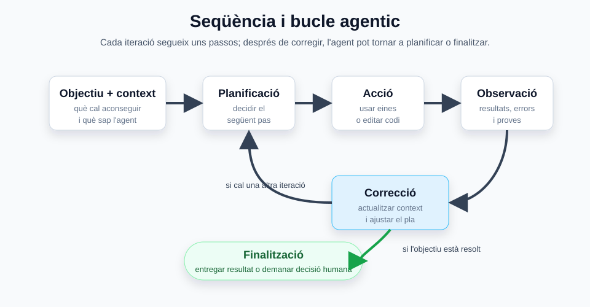
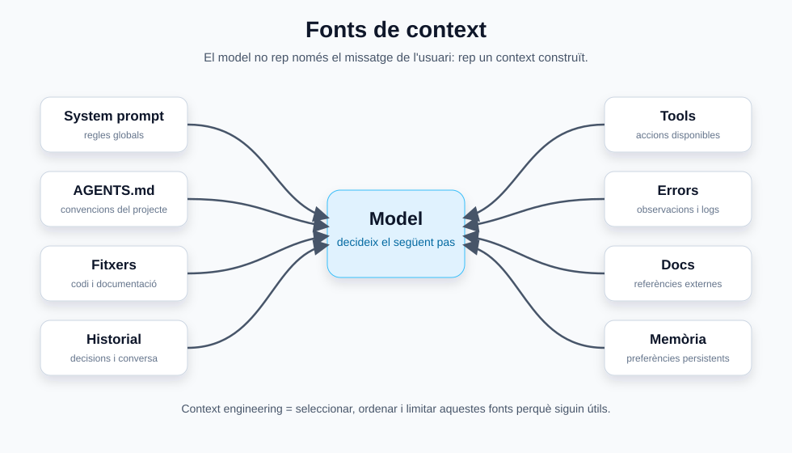

<style> .images { max-width: 960px; width: 100%; border: 1px solid grey; padding: 4px; margin-bottom: 25px; } </style>

# Agents

Un **agent** és un sistema que utilitza un model de llenguatge per avançar cap a un objectiu mitjançant context, eines i iteració.

No és només un prompt llarg. Un agent acostuma a tenir:

* un objectiu;
* instruccions;
* context;
* eines disponibles;
* capacitat d'observar resultats;
* criteris per decidir quan ha acabat.

La diferència amb una crida simple a un model és que l'agent pot treballar en diversos passos:

```text
Usuari
  -> objectiu
  -> agent
  -> planifica
  -> usa eines
  -> observa resultats
  -> corregeix
  -> entrega resultat
```

En programació, això permet que l'agent pugui llegir fitxers, executar tests, modificar codi, revisar errors i iterar.

---

## Abans de parlar d'agents: què és un LLM?

Un **LLM** (*Large Language Model*) és un model de llenguatge que genera text a partir d'una entrada. En una conversa simple funciona com un chatbot:

```text
Usuari: Hola
LLM: Hola, com puc ajudar?
```

El model no actua sobre el món per si sol. Calcula una resposta probable segons el text que rep, el seu entrenament i el context disponible.

Això és important perquè un agent no substitueix el model: l'agent és el sistema que dona al model context, eines i un bucle de treball.

### Pensament del model

Alguns models poden treballar amb modes de **raonament** o **thinking**. Això vol dir que abans de respondre poden analitzar la petició, separar-la en passos o decidir quina acció convé fer.

Es poden distingir tres casos:

| Tipus | Descripció | Exemple |
| --- | --- | --- |
| Sense pensament explícit | El model respon directament | `17 és primer.` |
| Raonament explícit | La resposta inclou una explicació del raonament | `Per saber si 17 és primer, miro si és divisible per 2, 3 o 5...` |
| Cadena de pensament interna | El model planifica o analitza abans de respondre, però aquest procés no forma part necessàriament de la resposta final | El model decideix comprovar divisibilitat abans de contestar |

En agents, el més rellevant no és que el model expliqui sempre tot el que pensa, sinó que pugui decidir bons passos: llegir informació, usar una eina, observar el resultat i continuar.

### Context bàsic

El **context** és la informació que el model té disponible en un moment concret. Pot incloure el que s'ha dit abans, instruccions, documents, fitxers, resultats d'eines i decisions preses.

Per exemple:

```text
Usuari: Em dic Toni.
LLM: D'acord, et dius Toni.

Usuari: Com em dic?
LLM: Et dius Toni.
```

El model pot respondre perquè el nom forma part del context recent. En un agent, el context és encara més important, perquè condiciona quines accions farà i quan decidirà que ja ha acabat.

## Què és un agent?

Un agent combina tres peces:

| Peça.       | Funció |
| ----------- | --- |
| **Model**   | Interpreta l'objectiu i decideix el següent pas |
| **Context** | Dona informació sobre el projecte, l'estat i les restriccions |
| **Eines**   | Permeten actuar sobre el món: llegir fitxers, executar comandes, cridar APIs, etc. |

Un xat normal amb IA pot respondre una pregunta. Un agent pot fer una tasca.

Per exemple:

```text
Pregunta simple:
  "Com funciona localStorage?"

Tasca agentica:
  "Afegeix localStorage a aquesta aplicació, valida que funciona i explica els canvis."
```

En el segon cas, el model necessita inspeccionar el codi, decidir on canviar-lo, editar fitxers, executar comprovacions i informar del resultat.

---

## Seqüència i bucle agentic

Molts agents treballen amb un objectiu inicial, però l'objectiu no és una etapa més del bucle. És el que guia la tasca i el criteri que permet decidir quan s'ha acabat.

El bucle acostuma a ser semblant a aquest:

```text
objectiu + context inicial
  -> planificació
  -> acció
  -> observació
  -> correcció
  -> context actualitzat
  -> planificació
  ...
  -> finalització quan l'objectiu està resolt
```



Aquest bucle és el que permet treballar amb problemes oberts: l'agent actua, observa què ha passat, actualitza el context i decideix el pas següent fins que pot entregar el resultat o necessita una decisió humana.

### Objectiu

L'objectiu és allò que l'usuari vol aconseguir.

Exemples:

```text
Crea una web amb un canvas i un xat.
Arregla els tests que fallen.
Explica aquest PR.
Converteix aquesta ordre en function calling.
```

Un bon objectiu no sempre ha d'explicar tots els passos. L'agent pot descobrir-los, però necessita saber què vol dir "fet". Per això l'objectiu també serveix com a criteri de finalització.

### Context

El context és la informació que l'agent té disponible en cada moment.

Pot incloure:

* missatge de l'usuari;
* instruccions del sistema;
* `AGENTS.md`;
* fitxers del projecte;
* historial de conversa;
* sortides de comandes;
* errors;
* resultats de tests;
* documentació recuperada;
* decisions preses anteriorment.

Sense bon context, l'agent pot prendre decisions correctes en abstracte però incorrectes per al projecte real.

### Planificació

La planificació és decidir quins passos cal fer.

No sempre cal un pla llarg. En tasques petites, pot ser suficient:

```text
1. Llegir el fitxer.
2. Fer el canvi.
3. Executar una comprovació.
```

En tasques grans, la planificació ajuda a separar fases:

```text
1. Entendre l'arquitectura.
2. Localitzar el punt de canvi.
3. Implementar.
4. Afegir proves.
5. Validar.
6. Resumir.
```

### Acció

L'acció és el moment en què l'agent usa una eina.

Exemples:

* llegir un fitxer;
* buscar text amb `rg`;
* editar codi;
* executar `npm test`;
* cridar una API;
* fer una consulta a un servidor local;
* obrir una pàgina al navegador.

El model decideix l'acció, però l'eina és qui l'executa.

### Observació

Després d'una acció, l'agent rep una observació.

Exemples:

```text
El fitxer existeix.
El test ha fallat.
El servidor respon HTTP 500.
La pàgina mostra el botó esperat.
El model ha retornat una tool_call invàlida.
```

L'observació alimenta el següent pas. Normalment no es torna a definir l'objectiu; es reinterpreta el context amb el que s'ha après i es decideix si cal corregir, continuar o finalitzar.

### Correcció

Quan alguna cosa falla o apareix informació nova, l'agent ha de corregir el pla o actualitzar el context abans de continuar.

Exemples:

* si un test falla, llegir l'error i ajustar el codi;
* si una eina retorna dades incompletes, provar una altra font;
* si el model retorna JSON invàlid, validar i demanar una nova sortida;
* si una ruta no existeix, inspeccionar l'estructura real del projecte.

La correcció és una part normal del treball agentic, no una excepció.

### Finalització

Un agent ha de saber quan parar.

Ha d'entregar una resposta final quan:

* l'objectiu està resolt;
* les comprovacions raonables han passat;
* hi ha un bloqueig que no pot resoldre;
* cal una decisió humana.

Un bon agent no continua actuant indefinidament només perquè pot fer més coses.

---

## Tool calls i harness

Perquè un agent pugui actuar, el model ha de saber demanar accions en un format que el sistema pugui entendre. Aquestes accions sovint s'anomenen **tool calls**.

Una tool call no és una resposta normal per a l'usuari, sinó una petició perquè el sistema executi una eina. Per exemple:

```json
{
  "tool": "edit_file",
  "path": "src/main.java",
  "line": 10,
  "content": "System.out.println(\"Hello, World!\");"
}
```

O bé:

```json
{
  "tool": "bash",
  "command": "tree",
  "path": "/home/user/Documents"
}
```

Només els models que han estat entrenats o adaptats per generar bé aquestes crides són realment útils per a agents amb eines. Si el model genera JSON invàlid, noms d'eines incorrectes o paràmetres inexistents, l'agent falla encara que la idea sigui bona.

### Què és el harness o arnès?

El **harness** o **arnès** és la part del sistema que envolta el model i fa possible el treball agentic.

S'encarrega de:

* donar instruccions i context al model;
* indicar quines eines estan disponibles;
* capturar les respostes de tipus tool call;
* comprovar si tenen un format vàlid;
* comprovar si l'acció és coherent amb les eines existents;
* aplicar permisos o restriccions;
* executar l'eina;
* retornar l'observació al context;
* decidir si cal continuar o entregar la resposta final.

Això permet separar dues peces:

```text
Model:
  pensa, parla i decideix accions

Harness:
  valida, executa eines, controla permisos i actualitza context
```

Amb un bon arnès es pot canviar de model amb més facilitat, perquè les normes del projecte, les eines i les comprovacions no depenen només del prompt del model.

### La paradoxa de l'arnès

Un arnès més gran no sempre fa millor l'agent. Sovint passa el contrari:

```text
arnès més senzill
  -> menys instruccions
  -> menys context innecessari
  -> menys confusió
  -> millor comportament
```

La idea pràctica és donar al model el mínim context suficient i les eines justes per fer la tasca. Com més curt i rellevant és el context, més fàcil és que el model decideixi bé.

### Harness mínim recomanat per programació

Una configuració senzilla pot ser:

```text
AGENTS.md
  -> normes del projecte, curtes i verificables

Agent líder
  -> entén l'objectiu, planifica i coordina

Subagent implementador
  -> fa canvis concrets

Subagent revisor
  -> comprova riscos, errors i tests

Fitxer de progrés
  -> documenta què s'ha fet, què falta i quins errors han aparegut
```

Per projectes petits, `AGENTS.md` hauria de ser curt. Una bona regla és mantenir-lo per sota d'unes 200 línies i evitar normes que no es puguin verificar.

Exemple de normes útils:

```text
Llegeix abans de modificar.
Fes canvis petits.
Executa els tests relacionats.
No donis la tasca per acabada si no has validat el resultat.
Explica només els canvis rellevants.
```

Exemple de normes poc útils:

```text
Fes-ho perfecte.
Sigues molt intel·ligent.
No cometis errors mai.
```

Les primeres orienten accions concretes. Les segones ocupen context però no ajuden gaire a decidir què fer.

---

## Context Engineering

El **context engineering** és el disseny de la informació que rep l'agent perquè pugui actuar bé.

No consisteix només a posar més text al prompt. Consisteix a posar el context adequat, en el moment adequat i amb la forma adequada.

### Fonts de context

Un agent de programació pot rebre context de moltes fonts:

| Font                      | Exemple |
| ------------------------- | --- |
| Instruccions globals      | Normes del sistema o de l'eina |
| Instruccions del projecte | `AGENTS.md`, README, convencions locals |
| Missatge de l'usuari      | Objectiu concret de la tasca |
| Codi                      | Fitxers llegits del repositori |
| Eines                     | Sortides de terminal, tests, logs |
| Historial                 | Decisions preses durant la sessió |
| Documentació.             | APIs, manuals, exemples |
| Memòria                   | Preferències o dades persistents, si existeixen |



El repte és que el context és limitat. No podem posar sempre tot el projecte dins del model.

### Context bo i context dolent

Bon context:

```text
Aquest projecte usa Express 5, el servidor està a server/app.js i les rutes API comencen per /api.
```

Context dolent:

```text
Aquí tens 40.000 línies de fitxers sense indicar què és rellevant.
```

El context bo és:

* rellevant;
* concret;
* actual;
* verificable;
* proper a la tasca.

### Compressió i pèrdua d'informació

Quan una sessió és llarga, pot caldre resumir o compactar context.

Això és útil, però pot perdre detalls:

* noms exactes de fitxers;
* decisions preses;
* errors ja trobats;
* restriccions de l'usuari;
* estat del servidor o de Git.

Per això és important que l'agent torni a verificar fets importants abans d'actuar, sobretot si poden haver canviat.

### Context i eines

Les eines també formen part del context.

Per exemple, una sortida de test:

```text
Expected "green" but received "verd"
```

pot ser més útil que una explicació llarga del problema, perquè dona una observació concreta.

El patró recomanat és:

```text
buscar poc
  -> llegir el necessari
  -> actuar
  -> validar
  -> ampliar context només si cal
```

### Memòria agentica

La **memòria agentica** és la informació que un agent pot conservar, recuperar i actualitzar més enllà del prompt immediat.

No és el mateix que l'historial del xat. L'historial és una transcripció del que ha passat. La memòria hauria de ser una selecció útil, estructurada i mantenible del que convé recordar.

Tipus habituals de memòria:

| Tipus | Què guarda | Exemple |
| --- | --- | --- |
| Memòria de treball | Informació de la sessió actual | Pla, errors recents, fitxers oberts |
| Memòria de sessió | Resum d'una tasca o conversa | Decisions preses durant una implementació |
| Memòria de projecte | Coneixement estable del repositori | Arquitectura, scripts, convencions |
| Memòria d'usuari | Preferències persistents | Idioma, estil de resposta, eines preferides |
| Memòria procedimental | Com fer una tasca recurrent | Workflow per validar una web |
| Memòria d'errors | Problemes que ja han passat | "Aquest test falla si no s'arrenca Redis" |

Un agent amb memòria pot seguir aquest patró:

```text
inici de sessió
  -> buscar memòria rellevant
  -> afegir-la al context
  -> treballar amb eines
  -> observar resultats
  -> escriure aprenentatges útils
  -> consolidar o descartar memòria antiga
```

La memòria és especialment útil quan:

* el projecte dura moltes sessions;
* hi ha convencions que es repeteixen;
* l'agent comet el mateix error més d'una vegada;
* hi ha preferències de l'usuari que no haurien de repetir-se sempre;
* diversos agents treballen sobre el mateix projecte.

Però la memòria també pot empitjorar un agent si no es governa bé.

Riscos:

* guardar informació incorrecta;
* recuperar records obsolets;
* donar massa pes a una preferència antiga;
* omplir el context amb records irrellevants;
* barrejar dades d'usuaris o projectes diferents;
* convertir una pista en una veritat no verificada.

Per això una bona memòria ha de tenir:

* abast clar: usuari, projecte, agent o organització;
* format llegible;
* data o versió;
* possibilitat d'actualitzar-se;
* possibilitat d'esborrar-se;
* criteris sobre què es pot recordar i què no.

Una pràctica útil és separar:

```text
Memòria estable:
  "Aquest projecte usa Express 5 i arrenca amb npm run dev."

Memòria provisional:
  "L'última vegada el port 3000 estava ocupat."
```

La primera pot viure a `AGENTS.md` o a documentació del projecte. La segona pot ser només una observació temporal que cal verificar abans d'actuar.

### Consolidació de memòria

Quan un agent revisa sessions anteriors i extreu patrons útils, està fent una forma de consolidació de memòria.

Algunes plataformes ho anomenen **dreaming**: un procés fora de la sessió principal que revisa historial, detecta patrons i proposa canvis a la memòria persistent.

En un entorn local es pot fer de manera més simple:

```text
logs de sessions
  -> resumir decisions importants
  -> detectar errors repetits
  -> actualitzar docs o memòria
  -> eliminar informació obsoleta
```

No cal que la consolidació sigui automàtica. En molts projectes educatius és millor que l'agent proposi canvis i una persona els revisi abans d'incorporar-los.

---

## Arquitectures habituals

No tots els agents tenen la mateixa arquitectura. La forma depèn de la tasca, el risc i les eines disponibles.


### Agent simple amb eines

És el patró més habitual.

```text
model
  -> decideix eina
  -> observa resultat
  -> decideix següent pas
```

Serveix per:

* modificar codi;
* consultar fitxers;
* executar tests;
* fer petites automatitzacions;
* respondre preguntes amb context local.

És l'arquitectura que es fa servir en moltes eines de coding agents.

### Planner-executor

En aquesta arquitectura hi ha una separació entre planificar i executar.

```text
planner
  -> crea pla
executor
  -> executa passos
  -> reporta resultats
planner
  -> ajusta pla si cal
```

És útil quan la tasca és llarga o té moltes dependències.

Riscos:

* massa planificació per tasques petites;
* plans que queden obsolets;
* cost més alt en tokens i temps.

### Agent amb subagents

Un agent principal pot delegar parts de la tasca a subagents especialitzats.

Exemples:

| Subagent | Funció |
| -------- | --- |
| Explorer | Investiga el codi |
| Reviewer | Revisa riscos i bugs |
| Tester   | Executa i interpreta tests |
| Frontend | Revisa UI i accessibilitat |

Pot ser útil per tasques grans, però no sempre cal. Coordinar subagents també té cost.

### Agent amb memòria

Un agent amb memòria pot conservar informació més enllà d'una conversa.

Pot recordar:

* preferències de l'usuari;
* convencions del projecte;
* decisions recurrents;
* configuracions habituals;
* errors ja resolts;
* workflows que han funcionat.

La memòria pot ser útil, però també és perillosa si queda obsoleta. Sempre cal distingir entre:

* memòria com a pista;
* estat actual verificat.

En programació, una memòria fiable no ha de substituir la lectura del codi. Ha d'ajudar a decidir què cal mirar primer.

### Agent amb RAG

RAG vol dir **Retrieval-Augmented Generation**. L'agent cerca informació en documents o bases de coneixement i la posa al context abans de respondre.

Flux típic:

```text
pregunta
  -> cerca documents rellevants
  -> recupera fragments
  -> posa fragments al context
  -> model respon amb fonts
```

És útil per:

* documentació extensa;
* manuals interns;
* bases de coneixement;
* repositoris grans;
* preguntes que depenen de fonts concretes.

Riscos:

* recuperar documents irrellevants;
* recuperar massa context;
* no citar fonts;
* confondre informació antiga amb informació actual.

### Agent revisor

Un patró útil és separar qui implementa de qui revisa.

```text
agent executor
  -> fa el canvi
agent revisor
  -> busca bugs, riscos i proves mancants
```

Aquest patró és útil en programació perquè redueix alguns errors evidents. Tot i així, no substitueix tests reals ni revisió humana quan el canvi és crític.

---

## Quan NO cal un agent

No tot necessita un agent.

Un agent és útil quan hi ha incertesa, context i decisions intermèdies. Però si el flux és completament determinista, un script normal pot ser millor.

No cal un agent per:

* validar un formulari simple;
* convertir un format conegut a un altre;
* executar una comanda fixa;
* fer una comprovació mecànica;
* aplicar una regla clara sense ambigüitat;
* repetir sempre el mateix procés sense variació.

Exemple:

```text
Convertir tots els fitxers .png a .webp amb la mateixa qualitat.
```

Això pot ser un script.

En canvi:

```text
Revisa aquesta aplicació, identifica millores importants, implementa les que siguin segures i valida el resultat.
```

Això sí que és una tasca agentica.

La pregunta pràctica és:

```text
Necessito que el sistema decideixi què fer després d'observar cada resultat?
```

Si la resposta és no, probablement no cal un agent.
