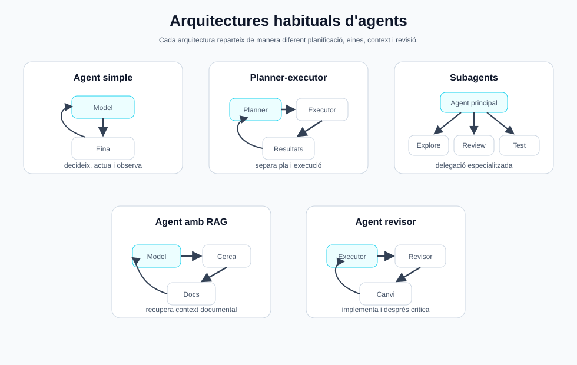

<style> .images { max-width: 960px; width: 100%; border: 1px solid grey; padding: 4px; margin-bottom: 25px; } </style>

# Agents

Un **agent** és un sistema que utilitza un model de llenguatge per avançar cap a un objectiu mitjançant context, eines i iteració.

No és només un prompt llarg. Un agent acostuma a tenir:

* un objectiu;
* instruccions;
* context;
* eines disponibles;
* capacitat d'observar resultats;
* criteris per decidir quan ha acabat.

La diferència amb una crida simple a un model és que l'agent pot treballar en diversos passos:

```text
Usuari
  -> objectiu
  -> agent
  -> planifica
  -> usa eines
  -> observa resultats
  -> corregeix
  -> entrega resultat
```

En programació, això permet que l'agent pugui llegir fitxers, executar tests, modificar codi, revisar errors i iterar.

---

## Què és un agent?

Un agent combina tres peces:

| Peça.       | Funció |
| ----------- | --- |
| **Model**   | Interpreta l'objectiu i decideix el següent pas |
| **Context** | Dona informació sobre el projecte, l'estat i les restriccions |
| **Eines**   | Permeten actuar sobre el món: llegir fitxers, executar comandes, cridar APIs, etc. |

Un xat normal amb IA pot respondre una pregunta. Un agent pot fer una tasca.

Per exemple:

```text
Pregunta simple:
  "Com funciona localStorage?"

Tasca agentica:
  "Afegeix localStorage a aquesta aplicació, valida que funciona i explica els canvis."
```

En el segon cas, el model necessita inspeccionar el codi, decidir on canviar-lo, editar fitxers, executar comprovacions i informar del resultat.

---

## El cicle agentic

Molts agents segueixen un bucle semblant:

```text
objectiu
  -> context
  -> planificació
  -> acció
  -> observació
  -> correcció
  -> finalització
```


Aquest bucle és el que permet treballar amb problemes oberts.

### Objectiu

L'objectiu és allò que l'usuari vol aconseguir.

Exemples:

```text
Crea una web amb un canvas i un xat.
Arregla els tests que fallen.
Explica aquest PR.
Converteix aquesta ordre en function calling.
```

Un bon objectiu no sempre ha d'explicar tots els passos. L'agent pot descobrir-los, però necessita saber què vol dir "fet".

### Context

El context és la informació que l'agent té disponible en cada moment.

Pot incloure:

* missatge de l'usuari;
* instruccions del sistema;
* `AGENTS.md`;
* fitxers del projecte;
* historial de conversa;
* sortides de comandes;
* errors;
* resultats de tests;
* documentació recuperada;
* decisions preses anteriorment.

Sense bon context, l'agent pot prendre decisions correctes en abstracte però incorrectes per al projecte real.

### Planificació

La planificació és decidir quins passos cal fer.

No sempre cal un pla llarg. En tasques petites, pot ser suficient:

```text
1. Llegir el fitxer.
2. Fer el canvi.
3. Executar una comprovació.
```

En tasques grans, la planificació ajuda a separar fases:

```text
1. Entendre l'arquitectura.
2. Localitzar el punt de canvi.
3. Implementar.
4. Afegir proves.
5. Validar.
6. Resumir.
```

### Acció

L'acció és el moment en què l'agent usa una eina.

Exemples:

* llegir un fitxer;
* buscar text amb `rg`;
* editar codi;
* executar `npm test`;
* cridar una API;
* fer una consulta a un servidor local;
* obrir una pàgina al navegador.

El model decideix l'acció, però l'eina és qui l'executa.

### Observació

Després d'una acció, l'agent rep una observació.

Exemples:

```text
El fitxer existeix.
El test ha fallat.
El servidor respon HTTP 500.
La pàgina mostra el botó esperat.
El model ha retornat una tool_call invàlida.
```

L'observació alimenta el següent pas.

### Correcció

Quan alguna cosa falla, l'agent ha de corregir el pla.

Exemples:

* si un test falla, llegir l'error i ajustar el codi;
* si una eina retorna dades incompletes, provar una altra font;
* si el model retorna JSON invàlid, validar i demanar una nova sortida;
* si una ruta no existeix, inspeccionar l'estructura real del projecte.

La correcció és una part normal del treball agentic, no una excepció.

### Finalització

Un agent ha de saber quan parar.

Ha d'entregar una resposta final quan:

* l'objectiu està resolt;
* les comprovacions raonables han passat;
* hi ha un bloqueig que no pot resoldre;
* cal una decisió humana.

Un bon agent no continua actuant indefinidament només perquè pot fer més coses.

---

## Context Engineering

El **context engineering** és el disseny de la informació que rep l'agent perquè pugui actuar bé.

No consisteix només a posar més text al prompt. Consisteix a posar el context adequat, en el moment adequat i amb la forma adequada.

### Fonts de context

Un agent de programació pot rebre context de moltes fonts:

| Font                      | Exemple |
| ------------------------- | --- |
| Instruccions globals      | Normes del sistema o de l'eina |
| Instruccions del projecte | `AGENTS.md`, README, convencions locals |
| Missatge de l'usuari      | Objectiu concret de la tasca |
| Codi                      | Fitxers llegits del repositori |
| Eines                     | Sortides de terminal, tests, logs |
| Historial                 | Decisions preses durant la sessió |
| Documentació.             | APIs, manuals, exemples |
| Memòria                   | Preferències o dades persistents, si existeixen |


El repte és que el context és limitat. No podem posar sempre tot el projecte dins del model.

### Context bo i context dolent

Bon context:

```text
Aquest projecte usa Express 5, el servidor està a server/app.js i les rutes API comencen per /api.
```

Context dolent:

```text
Aquí tens 40.000 línies de fitxers sense indicar què és rellevant.
```

El context bo és:

* rellevant;
* concret;
* actual;
* verificable;
* proper a la tasca.

### Compressió i pèrdua d'informació

Quan una sessió és llarga, pot caldre resumir o compactar context.

Això és útil, però pot perdre detalls:

* noms exactes de fitxers;
* decisions preses;
* errors ja trobats;
* restriccions de l'usuari;
* estat del servidor o de Git.

Per això és important que l'agent torni a verificar fets importants abans d'actuar, sobretot si poden haver canviat.

### Context i eines

Les eines també formen part del context.

Per exemple, una sortida de test:

```text
Expected "green" but received "verd"
```

pot ser més útil que una explicació llarga del problema, perquè dona una observació concreta.

El patró recomanat és:

```text
buscar poc
  -> llegir el necessari
  -> actuar
  -> validar
  -> ampliar context només si cal
```

---

## Arquitectures habituals

No tots els agents tenen la mateixa arquitectura. La forma depèn de la tasca, el risc i les eines disponibles.



### Agent simple amb eines

És el patró més habitual.

```text
model
  -> decideix eina
  -> observa resultat
  -> decideix següent pas
```

Serveix per:

* modificar codi;
* consultar fitxers;
* executar tests;
* fer petites automatitzacions;
* respondre preguntes amb context local.

És l'arquitectura que es fa servir en moltes eines de coding agents.

### Planner-executor

En aquesta arquitectura hi ha una separació entre planificar i executar.

```text
planner
  -> crea pla
executor
  -> executa passos
  -> reporta resultats
planner
  -> ajusta pla si cal
```

És útil quan la tasca és llarga o té moltes dependències.

Riscos:

* massa planificació per tasques petites;
* plans que queden obsolets;
* cost més alt en tokens i temps.

### Agent amb subagents

Un agent principal pot delegar parts de la tasca a subagents especialitzats.

Exemples:

| Subagent | Funció |
| -------- | --- |
| Explorer | Investiga el codi |
| Reviewer | Revisa riscos i bugs |
| Tester   | Executa i interpreta tests |
| Frontend | Revisa UI i accessibilitat |

Pot ser útil per tasques grans, però no sempre cal. Coordinar subagents també té cost.

### Agent amb memòria

Un agent amb memòria pot conservar informació més enllà d'una conversa.

Pot recordar:

* preferències de l'usuari;
* convencions del projecte;
* decisions recurrents;
* configuracions habituals.

La memòria pot ser útil, però també és perillosa si queda obsoleta. Sempre cal distingir entre:

* memòria com a pista;
* estat actual verificat.

### Agent amb RAG

RAG vol dir **Retrieval-Augmented Generation**. L'agent cerca informació en documents o bases de coneixement i la posa al context abans de respondre.

Flux típic:

```text
pregunta
  -> cerca documents rellevants
  -> recupera fragments
  -> posa fragments al context
  -> model respon amb fonts
```

És útil per:

* documentació extensa;
* manuals interns;
* bases de coneixement;
* repositoris grans;
* preguntes que depenen de fonts concretes.

Riscos:

* recuperar documents irrellevants;
* recuperar massa context;
* no citar fonts;
* confondre informació antiga amb informació actual.

### Agent revisor

Un patró útil és separar qui implementa de qui revisa.

```text
agent executor
  -> fa el canvi
agent revisor
  -> busca bugs, riscos i proves mancants
```

Aquest patró és útil en programació perquè redueix alguns errors evidents. Tot i així, no substitueix tests reals ni revisió humana quan el canvi és crític.

---

## Quan NO cal un agent

No tot necessita un agent.

Un agent és útil quan hi ha incertesa, context i decisions intermèdies. Però si el flux és completament determinista, un script normal pot ser millor.

No cal un agent per:

* validar un formulari simple;
* convertir un format conegut a un altre;
* executar una comanda fixa;
* fer una comprovació mecànica;
* aplicar una regla clara sense ambigüitat;
* repetir sempre el mateix procés sense variació.

Exemple:

```text
Convertir tots els fitxers .png a .webp amb la mateixa qualitat.
```

Això pot ser un script.

En canvi:

```text
Revisa aquesta aplicació, identifica millores importants, implementa les que siguin segures i valida el resultat.
```

Això sí que és una tasca agentica.

La pregunta pràctica és:

```text
Necessito que el sistema decideixi què fer després d'observar cada resultat?
```

Si la resposta és no, probablement no cal un agent.

---

## Resum

Un agent és una combinació de model, context i eines que treballa iterativament cap a un objectiu.

Les idees clau són:

* l'agent segueix un cicle d'objectiu, acció, observació i correcció;
* el context és part del disseny del sistema;
* les eines donen capacitat d'actuar, però també introdueixen risc;
* hi ha arquitectures diferents segons la complexitat;
* un agent no sempre és la millor solució.

Programar amb agents vol dir dissenyar bé aquest sistema, no només escriure un prompt.
