<style> .images { max-width: 400px; border: 1px solid grey; padding: 4px; margin-bottom: 25px; } </style>

# Programació amb agents

Els **agents** són eines basades en intel·ligència artificial que ajuden a desenvolupar programari d’una manera més autònoma que un xat tradicional.

En lloc de limitar-se a respondre preguntes, un agent pot analitzar el projecte, llegir fitxers, proposar canvis, modificar codi, executar ordres, revisar errors i ajudar a completar tasques de desenvolupament. Això permet treballar amb la IA com si fos un assistent tècnic dins del mateix entorn de programació.

Per exemple, un agent pot rebre una instrucció com:

> “Afegeix autenticació d’usuaris a aquest projecte”

I a partir d’aquí pot revisar l’estructura del codi, detectar quins fitxers cal modificar, generar el codi necessari i explicar els canvis realitzats.

La diferència principal respecte a un xat d’IA normal és que l’agent té **context del projecte** i pot utilitzar **eines** per actuar sobre el codi.

# OpenCode

**OpenCode** és una eina que permet utilitzar agents d’IA per programar des del terminal o des de l’entorn de desenvolupament.

Enllaç a [OpenCode](https://opencode.ai)

La seva funció principal és connectar un model d’IA amb el projecte de codi font. Això fa possible que l’agent pugui entendre l’estructura del projecte, consultar fitxers, generar modificacions i ajudar en tasques habituals de programació.

OpenCode pot treballar amb diferents models d’IA, tant comercials com locals, per exemple models executats amb Ollama o servidors compatibles amb l’API d’OpenAI.

També té una [extensió](https://marketplace.visualstudio.com/items?itemName=sst-dev.opencode) que obre la eina directament a [Visual Studio Code](https://code.visualstudio.com) 

És una eina basada en linia de comandes, i és indiferent si s'obre al terminal o com a extensió:

<center>
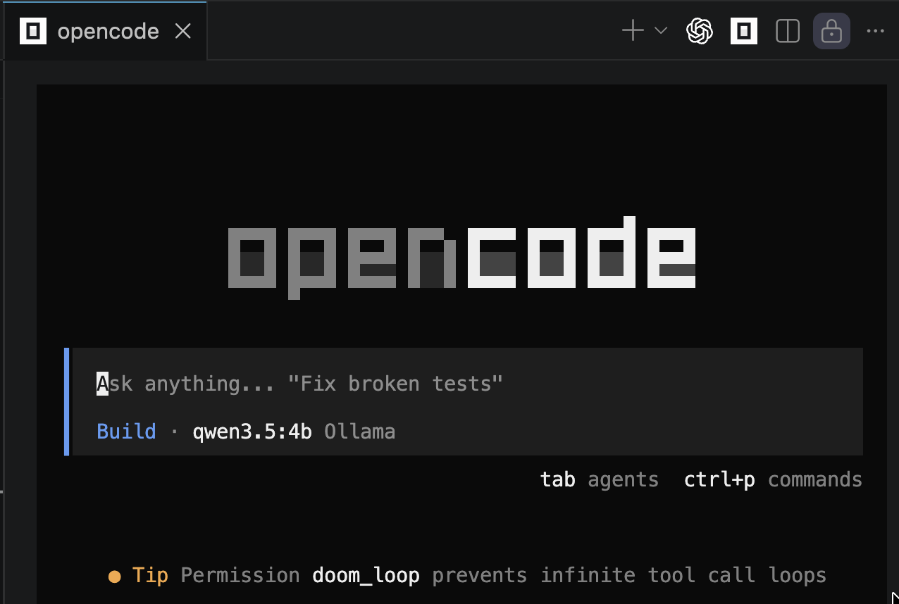
</center>

No és una eina de comandes tradicional, és una *Terminal User Interface* amb botons i menús emulant una aplicació d'escriptori que **interacciona amb el mouse**.

## Projectes OpenCode

OpenCode funciona des d'una carpeta de projecte, el més pràctic és:

- Si es fa servir des de la eina de comandes, accedir a la carpeta del projecte i executar opencode.

```bash
cd /path/to/project
opencode
```

- Si es fa servir com a extensió de Visual Studio Code, obrir l'extensió amb la carpeta arrel de projecte oberta.

## Login amb proveïdors de AIs

OpenCode permet connectar amb diferents models AI, per fer-ho cal tenir una API de client o un usuari/contrasenya segons el proveidor.

Per fer-ho amb linia de comandes:

```bash
opencode auth login
```

I per fer logout:

```bash
opencode auth logout
```

També es pot fer visualment desde OpenCode:

### ZEN

El servei gratuït que ofereix Open Code s'anomena **Zen**:

[OpenCode Zen](https://opencode.ai/zen)

Un cop donats d'alta, pots generar una clau d'accés *"API key"* a la pàgina web.

<center>
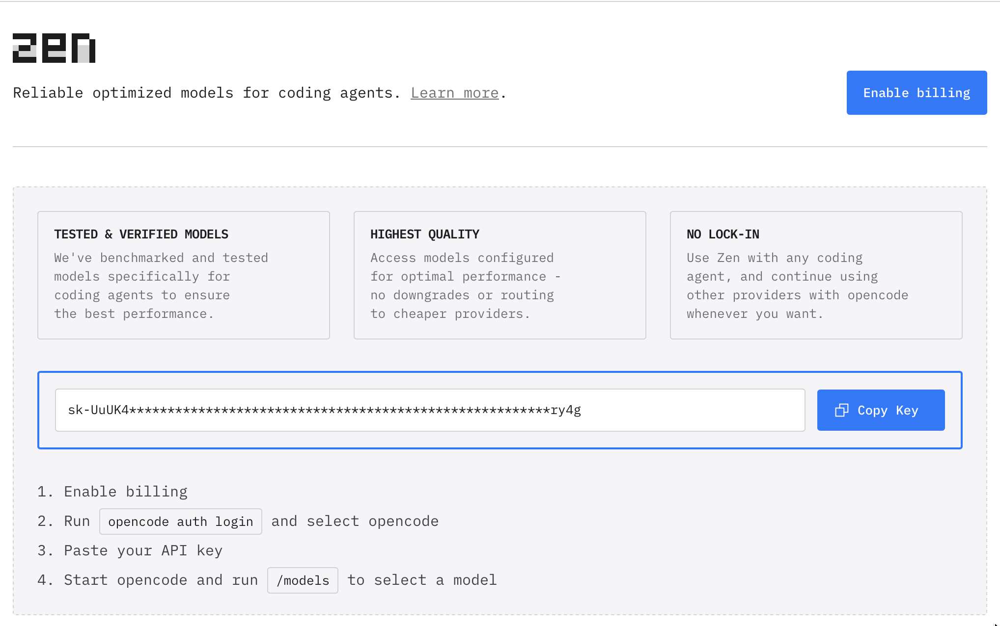
</center>

Es recomana esborrar les claus generades i no publicar-les enlloc:

<center>
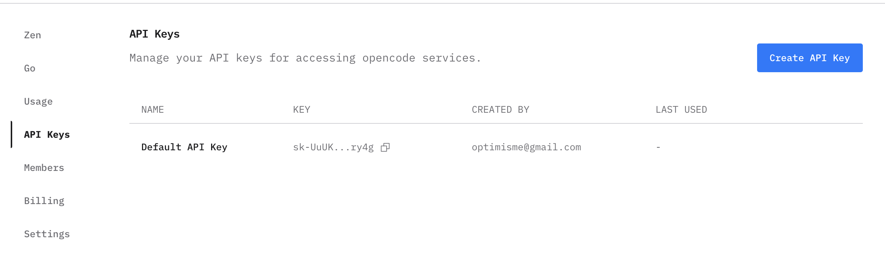
</center>

Amb la clau, es pot fer:

```bash
/connect
```

Escollir la opció **'OpenCode Zen'**, enganxar la clau:

<center>
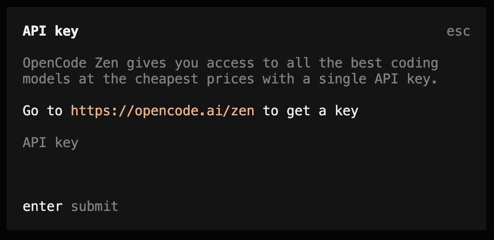
</center>

Segons el proveïdor, hi haurà uns models disponibles. Per canviar de model:

```bash
/models
```

<center>
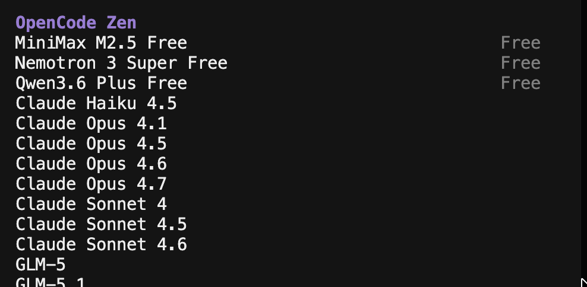
</center>

També es pot fer la connexió per linia de comandes:

```bash
opencode auth list
opencode auth login
```

Un cop feta la connexió es pot cridar opencode fora de l'entorn visual:

```bash
opencode run "say hello"
```

### NVIDIA

Com que els comptes gratuïts tenen limitacions d'ús, cal combinar els proveïdors. Per exemple amb NVIDIA:

[NVIDIA build](https://build.nvidia.com)

<center>
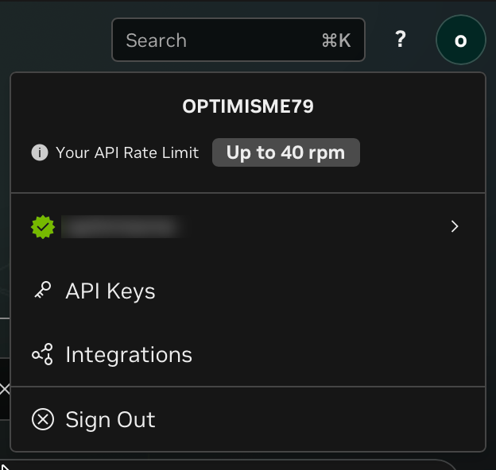
</center>

Podem gestionar les claus a "API Keys"

<center>
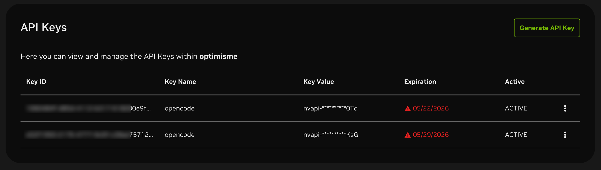
</center>

---
> **NOTA:** Tot i que molts models de NVIDIA digui *"Free Endpoint"*, hi ha un límit de 40 peticions cada hora.

<center>
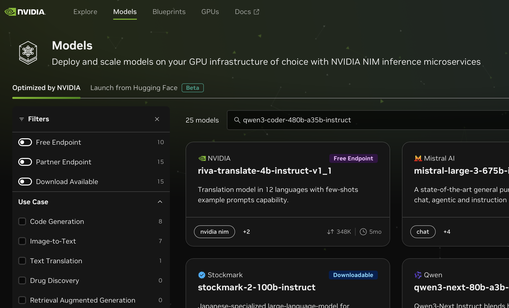
</center>

### OpenAI Codex

Per connectar amb Codex directament enlloc de fer servir la API cal instal·lar:

[OpenAI Codex Auth](https://github.com/numman-ali/opencode-openai-codex-auth)

```bash
npx -y opencode-openai-codex-auth@latest
opencode auth login
```

I fer login amb:

```text
ChatGPT Pro/Plus (browser)
```

## Interacció

La interacció amb OpenCode es fa de tres maneres:

### Comandes "/"

Quan s'escriu el caràcter "/" apareix el menú de comandes:

<center>
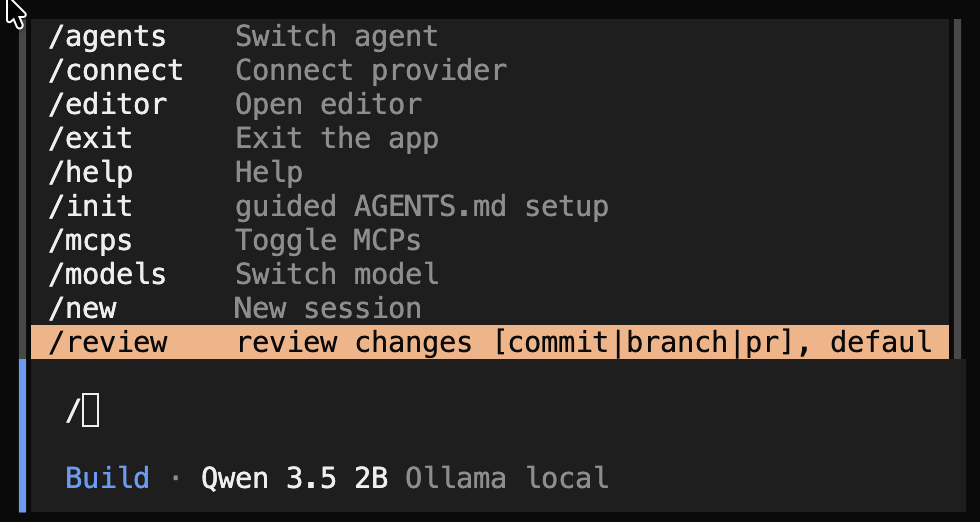
</center>

* **/agents**: mostra els agents disponibles i permet canviar entre agents com **Build** i **Plan**.

* **/connect**: permet configurar o iniciar la connexió amb un proveïdor d’IA, com OpenAI, Anthropic, Google, Ollama o altres.

* **/editor**: permet configurar o obrir la integració amb l’editor de codi.

* **/exit**: surt d’OpenCode i tanca la sessió actual.

* **/help**: mostra l’ajuda amb les comandes disponibles i informació bàsica d’ús.

* **/init**: analitza el projecte i crea un fitxer de context perquè l’agent entengui millor l’estructura i les normes del projecte.

* **/mcps**: mostra o gestiona els servidors MCP configurats, que són eines externes que l’agent pot utilitzar.

* **/models**: mostra els models disponibles i permet seleccionar quin model d’IA es vol fer servir.

* **/new**: crea una sessió nova de conversa o treball dins d’OpenCode.

* **/review**: revisa els canvis del projecte i ajuda a detectar errors, millores o problemes abans de donar-los per bons.

* **/sessions**: mostra les sessions obertes o anteriors i permet canviar entre converses de treball. Al vídeo es mostra que també es poden tenir sessions en paral·lel i recuperar-ne una que encara està en procés. 

* **/share**: genera un enllaç per compartir l’historial de la sessió, incloent els passos fets, el model utilitzat, les respostes i els canvis aplicats. 

* **/skills**: permet consultar o treballar amb les *skills* disponibles, que són instruccions especialitzades que amplien les capacitats de l’agent en àrees concretes com React, SEO, accessibilitat o disseny frontend. 

* **/status**: mostra informació de l’estat actual d’OpenCode, com la sessió, el model, el context utilitzat o altres dades de funcionament.

* **/themes**: permet canviar el tema visual de la interfície d’OpenCode, com Matrix, Monokai, One Dark, Vercel o altres. 

* **/thinking**: activa o desactiva la visualització del raonament o procés intern que mostra el model mentre està treballant.

* **/timeline**: mostra la línia del temps de la sessió, amb els prompts enviats, i permet buscar, tornar a un punt anterior, copiar un missatge o crear una nova sessió des d’aquell moment. 

* **/timestamps**: activa o desactiva la visualització de marques de temps als missatges de la sessió.

* **/undo**: desfà l’últim missatge o acció de la sessió; cal anar amb compte perquè, segons el vídeo, pot no revertir sempre els fitxers modificats i és millor fer commits freqüents. 

### Paleta de comandes (Ctrl+P)

Menú intern de la interfície, fora de la conversa amb l'agent.

<center>
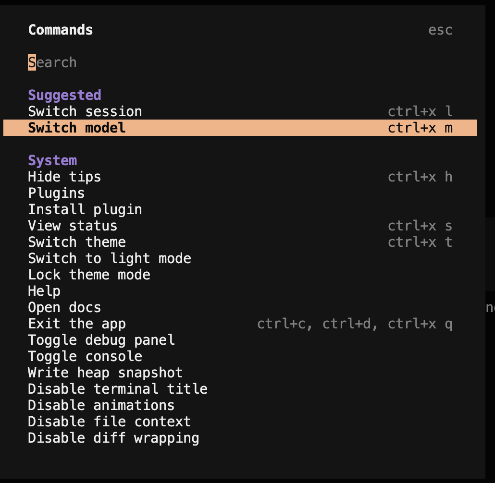
</center>

* **Switch session**: permet recuperar converses antigues o canviar a una altra sessió de treball.

* **Switch model**: permet canviar el model d’IA que està utilitzant OpenCode.

* **Hide tips**: amaga els consells o suggeriments que apareixen a la interfície.

* **Plugins**: mostra o gestiona els plugins disponibles dins d’OpenCode.

* **Install plugin**: permet instal·lar un plugin nou per afegir funcionalitats.

* **View status**: mostra informació sobre l’estat actual d’OpenCode, la sessió o la connexió.

* **Switch theme**: permet canviar el tema visual de la interfície.

* **Switch to light mode**: canvia la interfície al mode clar.

* **Lock theme mode**: fixa el mode del tema perquè no canviï automàticament.

* **Help**: obre l’ajuda amb informació sobre l’ús d’OpenCode.

* **Open docs**: obre la documentació oficial d’OpenCode.

* **Exit the app**: surt de l’aplicació.

* **Toggle debug panel**: mostra o amaga el panell de depuració.

* **Toggle console**: mostra o amaga la consola interna.

* **Write heap snapshot**: genera una captura de memòria per analitzar problemes tècnics.

* **Disable terminal title**: evita que OpenCode modifiqui el títol de la finestra del terminal.

* **Disable animations**: desactiva les animacions de la interfície.

* **Disable file context**: desactiva l’ús automàtic del context dels fitxers del projecte.

* **Disable diff wrapping**: evita que les línies llargues dels diffs es parteixin visualment.

### Agents

El xat d'OpenCode pot tenir accés a les dades del projecte, per llegir-les i/o modificar-les.

Per defecte hi ha dos "Agents" de funcionament, "Build" i "Plan", es pot canviar d'agent amb la tecla "TAB".

* **Plan**: serveix perquè OpenCode **analitzi el projecte i proposi una estratègia abans de modificar res**. És útil quan la tasca és gran, delicada o encara no tenim clar com implementar-la. En aquest mode, l’agent pot revisar codi i suggerir passos, però té restringida la capacitat de fer canvis als fitxers.

Exemple:

```text
Plan how to add an index.html that shows a canvas based circular clock with updated time
```

<center>
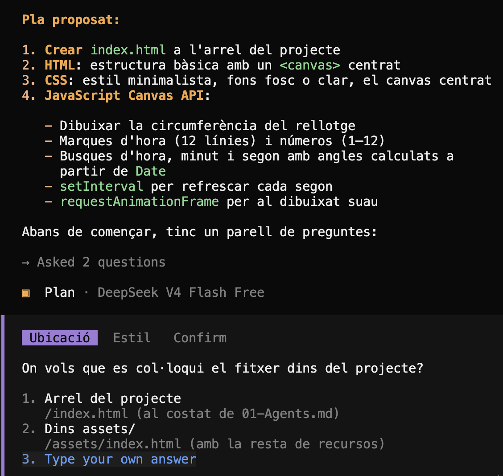
</center>

> **Nota:** El mode de planificació et pot fer preguntes sobre com resoldre el problema, i permet acceptar la planificació per implementar-la

* **Build**: serveix perquè OpenCode **apliqui canvis reals al projecte**, modifiqui fitxers, executi ordres i implementi funcionalitats. És el mode adequat quan ja tenim clar què volem fer o quan volem convertir un pla en codi.

Exemple:

```text
Crea un script que posi la següent capçalera a tots els arxius de codi ".java" de manera recursiva, només si no existeix.
// Copyright: Novita Nobi @ 2026
```

### Mode Shell

* **Shell**: serveix per executar comandes sense cridar cap agent. S'activa escrivint una exclamació ! com a primer caràcter de la petició:

```bash
!
```

<center>
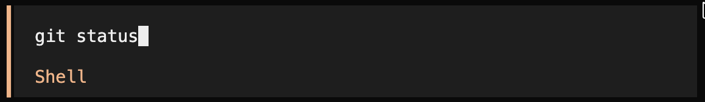
</center>


> **Nota**: Executar comandes a través de "!" permet registar-les a l'historial i fer que formin part de la conversa. Per exemple, permet preguntar:

```text
Revisa l’historial de la conversa on vaig fer un ls
```

## Context, tokens i cost

Quan treballem amb OpenCode, cada missatge que enviem, cada resposta de l’agent, cada fitxer que llegeix i cada resultat d’una eina formen part del **context** de la conversa.

El **context** és la informació que el model rep per poder entendre què està passant: historial de la conversa, instruccions, fragments de codi, sortides de terminal, errors, fitxers llegits, etc.

Els **tokens** són les unitats en què el model divideix el text. No són exactament paraules, sinó fragments de text. 

Com més gran és la conversa o més fitxers s’afegeixen al context, més tokens s’utilitzen. Això és important perquè molts proveïdors cobren segons la quantitat de tokens utilitzats o apliquen límits d’ús.

---
> **Nota:** La comanda **/compact** serveix per compactar la conversa. OpenCode resumeix l’estat actual de la sessió, conserva la informació important i elimina part de l’historial anterior. Això redueix el percentatge de context utilitzat. 
---

Cada servei té el seu mètode per fer seguiment de les estadístiques d'ús. Open Code té un paràmetre específic:

```bash
opencode stats --days 7
```

Normalment a través de la pròpia pàgina web. Per exemple:

[OpenAI Codex](https://chatgpt.com/codex/cloud/settings/analytics#usage)

## Bones pràctiques

1. **Ser molt específic amb el context**

   En lloc de preguntar coses generals com “estic bloquejant Google?”, és millor indicar directament el fitxer amb `@`, per exemple `@public/robots.txt`. Això evita que l’agent hagi de buscar per tot el projecte i redueix temps i tokens. 

2. **No demanar a l’agent que executi comandes simples**

   Si ja saps la comanda, no li diguis “executa `git status`”. Fes servir el mode shell amb `!` i escriu directament:

   ```bash
   git status
   ```

   Així no gastes tokens fent que el model interpreti una acció trivial. 

3. **Executar tu els tests i després passar-li l’error**

   Millor executa l'script de tests i dóna el resultat a l’agent: “arregla aquests tests que fallen”. 
   
   Això separa l’execució real de la feina intel·ligent. 

4. **Fer servir `AGENTS.md`**

   Recomana crear un `AGENTS.md` amb les normes del projecte: dependències permeses, arquitectura, comandes habituals, decisions tècniques, etc. 

   El fitxer també consumeix tokens, per tant no ha de ser llarg ni ple de generalitats. Ha de contenir decisions concretes i útils.

5. **Fer servir `/compact` quan el context creix**

   Quan la conversa acumula massa historial, `compact` resumeix la sessió i redueix el context utilitzat. A la transcripció baixa del 6% al 3%. 

6. **Fer servir `plan` abans de `build`**

   El mode `plan` serveix per analitzar i preparar una estratègia sense modificar fitxers. Després pots passar a `build` només per implementar allò que t’interessa.

7. **Usar subagents per dividir tasques**

   Recomana repartir investigacions en subagents especialitzats: seguretat, revisió de codi, rendiment, exploració, etc. 

8. **Crear comandes pròpies**

   Per tasques repetitives, com fer commits semàntics, es poden crear comandes a `.opencode/commands`. Així no cal escriure sempre el mateix prompt llarg.

9. **Treballar en anglès**

    En anglès normalment es gasten menys tokens i els models solen respondre millor, especialment amb models gratuïts o limitats. 

    [LLM tokens and foreign languages](https://ikriv.com/blog/?p=5322)

    [The Price of Your Language](https://www.beey.io/en/price-of-your-language-43945/)

10. **Escollir bé el model segons la tasca**

    Models més barats o ràpids per tasques senzilles, models més potents per planificació, arquitectura o resultats finals de més qualitat.

### Configuració d'OpenCode

Es pot configurar automàticament OpenCode amb un arxiu anomenat **'opencode.json'** a l'arrel del projecte.

Aquest arxiu permet definir serveis IA coneguts, amb les seves APIs i localitzacions. 

Funciona amb serveis locals com:

| Eina                               | Facilitat |      GUI | Velocitat | Multiusuari |
| ---------------------------------- | --------: | -------: | --------: | ----------: |
| [llama.cpp](https://llama-cpp.com) |     Baixa |  Via web |      Alta |       Mitjà |
| [Ollama](https://ollama.com)       |      Alta | Senzilla |     Baixa |        Baix |
| [LM Studio](https://lmstudio.ai)   |      Alta | Complexa |   Mitjana |        Baix |
| [vLLM](https://vllm.ai)            |   Mitjana |       No |      Alta |         Alt |

Exemple de configuració **'opencode.json'**:

- **model**: és el model escollit per defecte
- **provider**: admet més d'un proveidor (en forma de llista d'atributs)

```json
{
  "$schema": "https://opencode.ai/config.json",
  "model": "deepseek/deepseek-chat",
  "permission": {
    "read": "allow",
    "grep": "allow",
    "glob": "allow",
    "webfetch": "allow",
    "websearch": "allow",
    "bash": "allow",
    "edit": "allow",
    "task": "allow",
    "todowrite": "allow",
    "lsp": "allow",
    "skill": "allow"
  },
  "instructions": [
    "AGENTS.md",
    "docs/*.md"
  ],
  "provider": {
    "ollama": {
      "npm": "@ai-sdk/openai-compatible",
      "name": "Ollama local",
      "options": {
        "baseURL": "http://127.0.0.1:11434/v1"
      },
      "models": {
        "qwen2.5-coder:7b": {
          "name": "Qwen 2.5 Coder 7B",
          "tools": true
        }
      }
    },

    "deepseek": {
      "npm": "@ai-sdk/openai-compatible",
      "name": "DeepSeek API",
      "options": {
        "baseURL": "https://api.deepseek.com/v1",
        "apiKey": "{env:DEEPSEEK_API_KEY}"
      },
      "models": {
        "deepseek-chat": {
          "name": "DeepSeek Chat",
          "tools": true
        },
        "deepseek-reasoner": {
          "name": "DeepSeek Reasoner",
          "reasoning": true,
          "tools": true
        }
      }
    }
  }
}
```

Segons la configuració d'aquest projecte, per carregar les variables d'entorn cal fer:

- Crear un arxiu 'keys.env' a partir de l'exemple 'keys.env.example'

- Cridar 'opencode' amb 'run_opencode.sh' per carregar les variables d'entorn que hi ha a 'keys.env'

```bash
bash run_opencode.sh
```

---
> **Nota:** L'exemple anterior suposa que la clau API està a la variable d'entorn *"DEEPSEEK_API_KEY"*, però es podria posar directament de manera insegura:

```json
  "options": {
    "baseURL": "https://api.deepseek.com/v1",
    "apiKey": "sk-xxxxxxxxxxxxxxxxxxxxxxxx"
  },
```

## Sessions, historial i timeline

* **"/new"**: per començar una nova sessio/conversa

* **"/sessions"**: per accedir a les sessions anteriors, per rependre el fil d'una conversa.

* **"/timeline"**: per veure 

    Un cop escollida una conversa a través de "timeline", podem copiar-la al porta-retalls o fer-ne un "fork" i començar una nova conversa a partir d'aquell punt.
