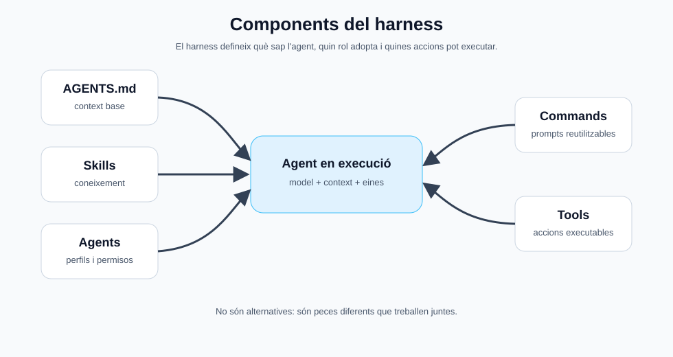
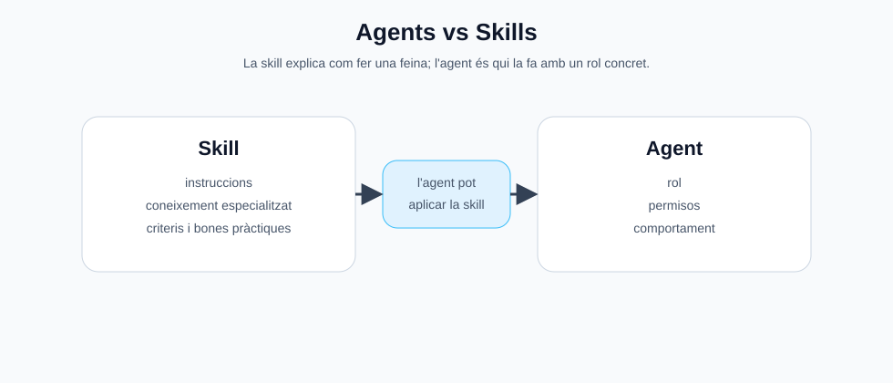

<style> .images { max-width: 960px; width: 100%; border: 1px solid grey; padding: 4px; margin-bottom: 25px; } </style>

# Harness engineering

**Harness engineering** és dissenyar tot l’entorn que envolta l’agent perquè treballi bé. 

Inclou eines, permisos, context, validacions, logs, tests, límits i fluxos de treball. 

El *Harness engineering* impulsa el *context del projecte*, és a dir, inclou la informació que l’agent d’IA té disponible per respondre o actuar dins d’un projecte. 

Pel què fa al context, a OpenCode pot incloure:

* L’historial recent de la conversa.
* Instruccions del projecte, com agents.md.
* Fitxers que l’agent ha llegit o que li hem indicat amb @.
* Resultats de comandes executades en mode shell.
* Resums generats amb /compact.
* Informació rellevant del codi, estructura o configuració del projecte.

## agents.md

És un fitxer de context del projecte per als agents d’IA. La transcripció el descriu com una mena de “README per a la intel·ligència artificial”: serveix per explicar al model com és el projecte i quines decisions ha de respectar.

**Evita repetir sempre les mateixes instruccions** al prompt. 

Forma part del context, i per tant és millor que sigui compacte.

Ha de contenir:

* **Workflow**: Passos que ha de seguir l’agent abans, durant i després de fer una tasca.
* **Stack**: Tecnologies que fa servir el projecte i limitacions tècniques.
* **Architecture**: Organització del projecte i responsabilitat de cada fitxer.
* **OpenCode**: Agents, skills, commands i tools disponibles per ajudar l’agent.
* **Rules**: Normes generals que l’agent ha de respectar sempre.

Exemple:

```text
# Project Guidelines

## Workflow

Before architectural changes, read `docs/architecture.md` and `docs/decisions.md`.

Before starting work, check `tasks/pending.md`.

After finishing work, update `tasks/done.md` and `tasks/pending.md`.

## Stack

HTML, CSS and vanilla JavaScript only.

No frameworks, no npm dependencies, no build step.

Use `bun run dev` to start the development server. Do not use `node` unless explicitly requested.

## Architecture

- `index.html`: main structure.
- `styles.css`: visual styles.
- `app.js`: application logic.

## OpenCode

- Agents are in `.opencode/agents/`.
- Skills are in `.opencode/skills/`.
- Commands are in `.opencode/commands/`.
- Tools are in `.opencode/tools/`.

Available agents: `explorer`, `goal-checker`, `reviewer`, `responsive`, `performance`, `teacher`.

Available skills: `code-review`, `frontend-design`, `accessibility`, `security`, `seo`.

Available commands: `supercommit`, `listpng`.

Available tools: `code-stats`.

Available MCPs: `web-check`, `java-check`, `memory`.

## Rules

Keep the project simple. Do not add external dependencies. Ask before changing the architecture. Prefer small, focused changes.
```

## Elements del context

| Element | Què és | Exemple |
|---|---|---|
| **Skill** | Coneixement o instruccions | “Com revisar seguretat” |
| **Agent** | Perfil que fa una tasca | `security`, `reviewer`, `frontend-designer` |
| **Command** | Prompt reutilitzable | `/supercommit`, `/fix-tests` |
| **Tool** | Acció executable | llegir fitxers, executar `bash`, consultar una API |



# Skills (habilitats)

Una **skill** serveix per donar a l’agent més experiència en una tasca específica. Normalment és contingut en Markdown amb instruccions, criteris i bones pràctiques.

Per exemple, potser el model sap programar React, però no coneix bé les bones pràctiques d’una versió concreta o d’una llibreria determinada. Amb una skill li dones aquest context extra.

Cal posar les *skills* segons aquesta estructura:

```bash
# .opencode/skills/<nom-skill>/SKILL.md
projecte/
└── .opencode/
    └── skills/
        └── seo/
            └── SKILL.md
```

Teniu diversos exemples de skills en aquest mateix projecte.

## autoskills

Hi ha eines que permeten instal·lar automàticament les skills segons cada projecte:

```bash
npx autoskills@latest
```

# Agents

## Agents principals

OpenCode té dos agents principals visibles:

| Agent     |  Funció                                  |
| --------- | ---------------------------------------- |
| **Plan**  | Per analitzar i planificar sense editar. |
| **Build** | Per desenvolupar i modificar fitxers.    |

* **Build** té accés a escriure al disc
* **Plan** serveix per explorar el projecte

> **Nota:** Hi ha altres agents interns, com `compact`, `title` i `resume`, però no són agents que l’usuari utilitzi directament. 

Es poden definir més agents principals a la carpeta *"./opencode/agents"* amb la capçalera **"mode: primary"**.

La variant local d'aquest curs defineix un agent principal anomenat `goal-lite`, pensat per a models petits i edicions controlades:

```bash
# .opencode/agents/<nom-agent>.md
projecte/
└── .opencode/
    └── agents/
        └── goal-lite.md
```

```text
---
description: Complete one implementation request with safe-edit and one verification/fix pass.
mode: primary
permission:
  read: allow
  grep: allow
  glob: allow
  bash: deny
  edit: deny
  task: deny
---
```

Aleshores podrem escollir el nou agent amb la tecla **TAB**. Se li pot donar un objectiu concret:

```text
Arregla els errors de validació HTML del projecte, modifica només els fitxers necessaris i verifica el resultat abans de respondre.
```

> **Nota:** A `projectOpenCodeLite`, hi ha l'agent `goal-lite` activat per defecte, que és l'agent principal perquè la configuració local necessita menys eines, menys soroll i un flux més controlat.

## Subagents

Els **subagents** són agents secundaris especialitzats que poden treballar en una tasca concreta sense bloquejar necessàriament el fil principal.

Serveixen per fer feines en paral·lel que poden produir molt soroll (logs, cerques a internet, pensament), i així no "embrutar" el context principal.

| Subagent     | Ús                                        |
| ------------ | ----------------------------------------- |
| **Explore**  | Explorar una part concreta del projecte.  |
| **General**  | Investigar una qüestió més oberta.        |
| **Reviewer** | Revisar codi sense modificar-lo.          |
| **Security** | Revisar possibles problemes de seguretat. |

Per exemple, `Explore` pot buscar quines custom properties de CSS hi ha al projecte, mentre que `General` pot investigar com afegir tests d’integració sense trencar res. 

Els subagents també es defineixen a la carpeta *"./opencode/agents"*, però amb la capçalera **"mode: subagent"**

```bash
# .opencode/agents/<nom-agent>.md
projecte/
└── .opencode/
    └── agents/
        └── reviewer.md
```

```text
---
description: Review code quality, maintainability, bugs and pending changes without modifying files.
mode: subagent
permission:
  edit: deny
  bash:
    "git status*": allow
    "git diff*": allow
    "git log*": allow
    "grep*": allow
    "rg*": allow
    "*": ask
---

Els subagents no s'activen amb *TAB*, els ha de fer servir un agent principal, bé proactivament o bé a través de la conversa:

```text
Use the Security subagent to review possible security issues.
```

```text
Use the Explore subagent to find the project’s CSS variables.
```

Una estructura normal d'agent amb subagents pot ser:

```text
.opencode/
└── agents/
    ├── master.md
    ├── analyst.md
    ├── coder.md
    └── reviewer.md
```

## Agents vs Skills

- La skill és el manual.
- L’agent és la "persona" que fa la feina.

| Element              | Què és                    | Per a què serveix                                              |
| -------------------- | ------------------------- | -------------------------------------------------------------- |
| **Skill `security`** | Coneixement especialitzat | Explica **com revisar seguretat**                              |
| **Agent `security`** | Treballador especialitzat | Fa la feina de **revisar seguretat** amb uns permisos concrets |



Per donar coneixement a l'agent sobre la skill, pot contenir una instrucció de l'estil:

```text
Read and apply the security skill located at @.opencode/skills/security/SKILL.md.
```

---
> **Nota:** Fixeu-vos que els noms dels agents i les skills no tenen que coincidir, sinó complementar-se:

**frontend-designer** vs *frontend-design*

```bash
.opencode/agents/frontend-designer.md
.opencode/skills/frontend-design/SKILL.md 
```

# Comandes

L'agent **"Build"** de OpenCode, té accés a la linia de comandes. Però OpenCode permet executar ordres directament, apuntant l'execució a l'historial de conversa.

És més recomanable fer:

```bash
! git status
```

Que no pas demanar al prompt:

```text
executa git status
```

## Comandes personalitzades

Les comandes que s'han d'executar diverses vegades, es poden definir en arxius *markdown* dins de **"commands"**.

Per exemple, enlloc d'anar demanant:

```text
review changes, group them into commits and then push
```

Millor definir una comanda:

```bash
# .opencode/commands/<nom-comanda>.md
projecte/
└── .opencode/
    └── commands/
        └── supercommit.md
```

Aleshores per executar la comanda, només cal:

```text
/supercommit
```

O també amb instruccions:

```text
/supercommit write commit messages in Catalan
```

Els arxius de comandes personalitzades cal que tinguin una petita descripció, i les instruccions:

```text
---
description: Short description of the command
---

Additional user context:
$ARGUMENTS

## Goal

Explain clearly what this command must achieve.

## Steps

1. First step.
2. Second step.
3. Third step.

## Rules

- Important restriction.
- Important security rule.
- What the agent must not do.

## Output

At the end, summarize:
- what was checked;
- what was changed;
- what still needs attention.
```

- Comandes personalitzades
- Comandes globals i comandes de projecte
- Ús de opencode run
- Ús de opencode serve
- OpenCode Web

## 'opencode run' (taskes automatitzades)

L'ús de comandes personalitzades permet automatizar OpenCode per fer tasques repetitives.

**run** és útil quan vols fer servir OpenCode com una eina de línia de comandes, no com un xat interactiu.

```bash
opencode run --command listpng
```

Executaria el supercommit com una instrucció intel·ligent.

Altres exemples d'eines personalitzades útils, que caldria personalitzar segons cada projecte:

| Comanda             | Ús                                               |
| ------------------- | ------------------------------------------------ |
| `/security`         | Busca problemes de seguretat                     |
| `/explain`          | Explica l’arquitectura del projecte              |
| `/tests`            | Analitza tests fallits i proposa solucions       |
| `/fix-tests`        | Intenta corregir tests fallits                   |
| `/docs`             | Genera o millora documentació                    |
| `/frontend-review`  | Revisa accessibilitat, responsive i UX           |
| `/clean`            | Busca fitxers sobrants, codi mort o dependències |


# Tools (eines)

Les **tools** són les capacitats que permeten a l’agent fer accions reals sobre el projecte: llegir fitxers, escriure codi, executar comandes, cercar informació o cridar eines externes.

OpenCode ja incorpora eines internes com `read`, `write`, `bash`, `websearch`, `todowrite` o `question`. Aquestes eines permeten que l’agent actuï dins del projecte, no només que respongui text. 

Per exemple, `bash` permet executar ordres com `git status`, `npm test` o `bun run dev`; `todowrite` permet organitzar tasques complexes, i `question` permet que l’agent pregunti a l’usuari quan necessita una decisió.

## Eines integrades

Algunes eines habituals són:

| Tool | Ús |
|---|---|
| `read` | Llegir fitxers del projecte |
| `write` | Crear o substituir fitxers |
| `edit` | Modificar parts concretes d’un fitxer |
| `bash` | Executar comandes de terminal |
| `grep` / `glob` | Buscar text o fitxers |
| `todowrite` | Crear una llista interna de passos |
| `websearch` | Cercar informació externa |
| `question` | Fer preguntes a l’usuari durant una tasca |

La idea principal és que el model no “sap” automàticament què hi ha dins del projecte: ho descobreix usant eines.

Per exemple:

```text
Revisa els tests fallits i proposa una solució.
````

Això pot fer que l’agent utilitzi eines com:

```text
read       -> mirar fitxers
bash       -> executar tests
grep/glob  -> buscar funcions o classes
edit       -> modificar el codi
```

## Custom tools

OpenCode permet crear **custom tools**. Són funcions pròpies que l’agent pot cridar durant una conversa. Es defineixen amb TypeScript o JavaScript, però poden executar scripts escrits en altres llenguatges.

## MCPs

Els **MCPs** (*Model Context Protocol*) són una manera estàndard de connectar un agent d’IA amb eines externes.

Sense MCP, l’agent normalment només pot respondre amb text.

Amb MCP, pot accedir a serveis o eines com:

* Arxius del projecte
* GitHub
* Bases de dades
* APIs externes
* Navegadors
* Eines pròpies creades pel programador

---

## Custom tool o MCP?

Una custom tool d’OpenCode és bona per a ús ràpid dins d’un projecte OpenCode.

Un MCP és millor quan vols que la mateixa eina sigui reutilitzable per diferents agents.

| Cas                                            | Opció               |
| ---------------------------------------------- | ------------------- |
| Seqüència d’instruccions en llenguatge natural | Custom command      |
| Només es fa servir amb OpenCode                | Custom tool         |
| S'ha de compartir amb Codex, Claude o altres.  | MCP                 |
| Accés estructurat a una API o base de dades    | Custom tool o MCP   |
