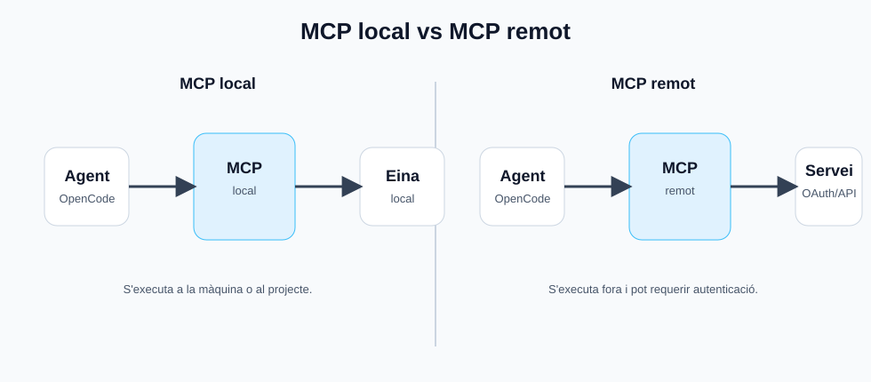
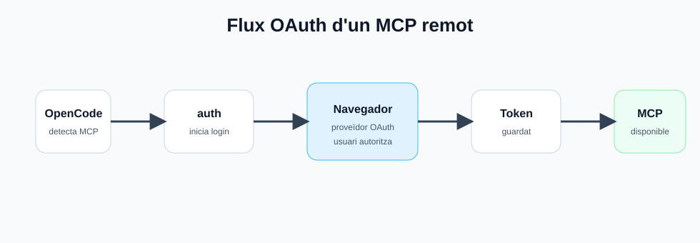
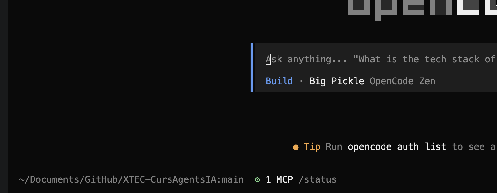

<style> .images { max-width: 960px; width: 100%; border: 1px solid grey; padding: 4px; margin-bottom: 25px; } </style>

# MCPs a OpenCode

**MCP** vol dir **Model Context Protocol**. És un protocol que permet connectar un agent d’IA amb eines, serveis o dades externes d’una manera estàndard.

Un MCP no és simplement una comanda. És un **servidor d’eines** que OpenCode pot carregar i oferir al model com si fossin tools disponibles.

* **MCPs locals**: Funcionen com un servidor intern sobre el nostre sistema o per comunicar-se amb serveis externs.

* **MCPs remots**: Connecten directament amb serveis externs que compleixen els protocols MCPs.

---

## Per a què serveix un MCP?

Un MCP serveix per connectar OpenCode amb funcionalitats externes com:

| MCP            | Ús                                            |
| -------------- | --------------------------------------------- |
| GitHub         | Consultar issues, pull requests o repositoris |
| Base de dades  | Consultar dades d’un projecte                 |
| Sistema intern | Connectar amb eines pròpies d’una empresa     |
| API externa    | Donar accés controlat a un servei remot       |
| Memòria        | Recuperar i guardar coneixement entre sessions |

La idea és que l’agent no només pugui llegir o editar fitxers, sinó també **interactuar amb sistemes externs**.



---

## Configuració dels MCPs?

Els MCPs es configuren dins l’arxiu *"opencode.json"* dins l'atribut *"mcp"*:

```json
{
  "$schema": "https://opencode.ai/config.json",
  "mcp": {}
}
```

---

## MCPs locals

Els MCPs locals s'executen dins la pròpia màquina, si formen part del projecte i s'han d'arrencar amb OpenCode, cal definir-los:

```bash
# .opencode/mcp/<nom-mcp-local>/
projecte/
└── .opencode/
    └── mcp/
        └── my-local-mcp/
```

Exemple de configuració a *"opencode.json"*:

```jsonc
{
  "$schema": "https://opencode.ai/config.json",
  "mcp": {
    "my-local-mcp": {
      "type": "local",
      "command": ["npx", "-y", "my-mcp-command"],
      "enabled": true
    }
  }
}
```

En aquest cas, OpenCode executa la comanda indicada a `command` per iniciar el servidor MCP. 

---

## Exemple de MCP local del projecte

En `projecteOpenCode`, els MCPs locals principals combinen validació i memòria:

| MCP | Ús |
| --- | --- |
| `html-check` | Comprovar fitxers HTML després d'una modificació |
| `java-check` | Comprovar fitxers Java després d'una modificació |
| `memory` | Recuperar i guardar memòria curada del projecte |

La configuració a `opencode.json` és:

```jsonc
{
  "$schema": "https://opencode.ai/config.json",
  "mcp": {
    "html-check": {
      "type": "local",
      "command": ["node", ".opencode/mcp/html-check/server.js"],
      "enabled": true
    },
    "java-check": {
      "type": "local",
      "command": ["node", ".opencode/mcp/java-check/server.js"],
      "enabled": true
    },
    "memory": {
      "type": "local",
      "command": ["node", ".opencode/mcp/memory/server.js"],
      "enabled": true,
      "environment": {
        "MEMORY_DIR": "memory"
      }
    }
  }
}
```

Un flux habitual seria:

1. Consultar la memòria només si pot aportar context reutilitzable.
2. Modificar el fitxer amb les eines estàndard d'OpenCode.
3. Executar el MCP de validació corresponent.
4. Corregir els errors detectats abans de donar la tasca per acabada.
5. Proposar una actualització de memòria si s'ha après una convenció o error recurrent.

Per exemple, es pot demanar a OpenCode:

```text
Update webs/index.html and then run html-check on the changed file.
```

### MCPs per a models petits

`projecteOpenCodeLocal` sí que inclou un MCP local anomenat `safe-edit`. Serveix per modificar fitxers de manera controlada quan es fan servir models petits: llegir línies concretes, aplicar canvis petits i verificar el resultat després de cada edició.

Aquest servidor exposa eines com:

| Tool | Ús |
| --- | --- |
| `safe_read_lines` | Llegir un rang de línies abans d'editar |
| `safe_apply_patch` | Aplicar un canvi amb un diff verificable |
| `safe_replace_lines` | Substituir només un rang concret de línies |
| `safe_verify_file` | Verificar el fitxer o una secció després d'editar |

Exemple de prompt per a la variant lite:

```text
Use the safe-edit MCP to update app.js. First read the target lines with safe_read_lines, apply only the needed change, then verify the changed section with safe_verify_file.
```

La configuració completa d'aquesta variant es resumeix a la secció final de `05-Servidors.md`.

### MCP de memòria per a models grans

Un MCP també pot servir com a capa de **memòria persistent** per a l'agent.

La idea és que el model no depengui només del context de la conversa actual. Pot consultar records útils abans d'actuar i escriure aprenentatges després d'una tasca.

Eines típiques d'un MCP de memòria:

| Tool | Ús |
| --- | --- |
| `memory_search` | Cercar records rellevants per una consulta |
| `memory_read` | Llegir un record concret |
| `memory_write` | Guardar un nou record |
| `memory_update` | Actualitzar un record existent |
| `memory_forget` | Esborrar o invalidar un record |
| `memory_summarize_session` | Resumir una sessió i proposar aprenentatges |

Exemple de configuració local:

```jsonc
{
  "$schema": "https://opencode.ai/config.json",
  "mcp": {
    "memory": {
      "type": "local",
      "command": ["node", ".opencode/mcp/memory/server.js"],
      "enabled": true,
      "environment": {
        "MEMORY_DIR": "memory"
      }
    }
  }
}
```

Una estructura senzilla del projecte podria ser:

```bash
projecte/
├── memory/
│   ├── project.md
│   ├── user-preferences.md
│   ├── workflows.md
│   ├── recurring-errors.md
│   └── session-summaries/
└── .opencode/
    └── mcp/
        └── memory/
            └── server.js
```

Flux habitual:

```text
1. L'agent rep una tasca.
2. Crida memory_search amb l'objectiu de la tasca.
3. Afegeix els records rellevants al context.
4. Treballa amb fitxers, tools i validacions.
5. En acabar, proposa records nous o actualitzacions.
6. La memòria s'actualitza automàticament o amb revisió humana.
```

Exemple de prompt:

```text
Before changing the project, search the memory MCP for relevant conventions and recurring errors. After finishing, propose any memory updates instead of writing secrets or temporary state.
```

Aquest patró té més sentit amb **models grans** o agents que treballen durant moltes sessions, perquè poden aprofitar millor records diversos i decidir quan són rellevants.

En `projecteOpenCodeLocal`, que està pensat per a models petits i edicions controlades, no és imprescindible afegir aquest MCP. Pot ser útil com a exercici avançat, però el risc és que un model petit recuperi massa memòria, la interpreti malament o la prioritzi per sobre del codi actual.

Per a models petits, sovint és millor:

* `AGENTS.md` curt i molt explícit;
* tools concretes com `safe-edit`;
* memòria mínima i molt curada;
* validació després de cada pas.

Per a models grans, una memòria MCP pot aportar més valor:

* continuïtat entre sessions;
* aprenentatge de patrons del projecte;
* preferències persistents;
* errors recurrents;
* workflows consolidats;
* coordinació entre agents.

La memòria no ha de substituir la verificació. Un record pot orientar, però l'agent ha de comprovar l'estat real del projecte abans de modificar-lo.

### Opcions d’un MCP local

| Camp          | Obligatori | Funció                              |
| ------------- | ---------: | ----------------------------------- |
| `type`        |         Sí | Ha de ser `"local"`                 |
| `command`     |         Sí | Comanda per iniciar el servidor MCP |
| `environment` |         No | Variables d’entorn                  |
| `enabled`     |         No | Activa o desactiva el servidor      |
| `timeout`     |         No | Temps màxim per obtenir les eines   |

---
> **Nota:** El `timeout` per defecte és de 5000 ms.

---

## MCP remot

Un MCP remot és un servidor que ja està funcionant en una URL.

Exemple:

```jsonc
{
  "$schema": "https://opencode.ai/config.json",
  "mcp": {
    "my-remote-mcp": {
      "type": "remote",
      "url": "https://my-mcp-server.com",
      "enabled": true,
      "oauth": false,
      "headers": {
        "Authorization": "Bearer {env:MY_API_KEY}"
      }
    }
  }
}
```

### Opcions d’un MCP remot

| Camp      | Obligatori | Funció                            |
| --------- | ---------: | --------------------------------- |
| `type`    |         Sí | Ha de ser `"remote"`              |
| `url`     |         Sí | URL del servidor MCP              |
| `enabled` |         No | Activa o desactiva el servidor    |
| `headers` |         No | Capçaleres HTTP                   |
| `oauth`   |         No | Configuració OAuth                |
| `timeout` |         No | Temps màxim per obtenir les eines |

### MCP remot amb OAuth

Alguns MCPs remots necessiten autenticació OAuth.

Exemple:

```json
{
  "$schema": "https://opencode.ai/config.json",
  "mcp": {
    "my-oauth-server": {
      "type": "remote",
      "url": "https://mcp.example.com/mcp"
    }
  }
}
```

En el cas d'autenticar-se amb OAuth, OpenCode inicia el flux OAuth al fer servir el servidor. També es pot iniciar aquest flux manualment amb:



```bash
opencode mcp auth my-oauth-server
```

Per tancar la sessió OAuth:

```bash
opencode mcp logout my-oauth-server
```

---

## Variables d’entorn

És millor no posar claus directament dins `opencode.json`.

Millor:

```jsonc
{
  "headers": {
    "Authorization": "Bearer {env:GITHUB_TOKEN}"
  }
}
```

Així la clau es pot definir fora:

```bash
export GITHUB_TOKEN="..."
```

La configuració d’OpenCode permet substituir variables d’entorn amb la sintaxi `{env:VARIABLE_NAME}`.

---

## Comandes útils per gestionar MCPs

OpenCode inclou comandes CLI per gestionar MCPs. 

| Comanda                     | Funció                                    |
| --------------------------- | ----------------------------------------- |
| `opencode mcp add`          | Afegeix un MCP de forma guiada            |
| `opencode mcp list`         | Mostra els MCPs configurats               |
| `opencode mcp ls`           | Versió curta de `list`                    |
| `opencode mcp auth`         | Autentica un MCP amb OAuth                |
| `opencode mcp auth list`    | Mostra l’estat d’autenticació             |
| `opencode mcp logout`       | Elimina credencials OAuth                 |
| `opencode mcp debug <name>` | Diagnostica problemes de connexió o OAuth |

---

## Ús d’un MCP dins d’OpenCode

Les MCPs actives i/o configurades surten a la barra d'estat de OpenCode:

<center>

</center>

No hi ha un símbol especial per cridar un MCP.

Es fa amb llenguatge natural, igual que amb les tools:

```text
Use the github MCP to list open issues.
```

La carpeta dels MCPs locals del projecte queda dins `.opencode/mcp/`. En el projecte normal hi ha MCPs de validació:

```bash
# .opencode/mcp/<nom-mcp-local>/
projecte/
└── .opencode/
    └── mcp/
        ├── html-check
        └── java-check
```

En `projecteOpenCodeLocal` també hi ha `safe-edit`, que és específic de la configuració per a models petits.
