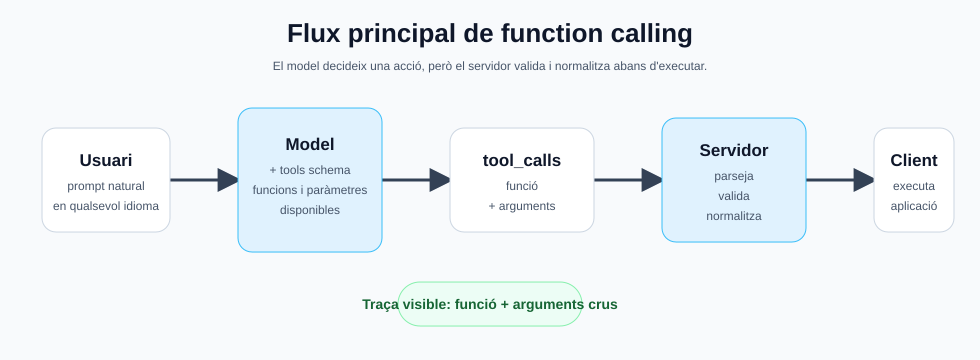
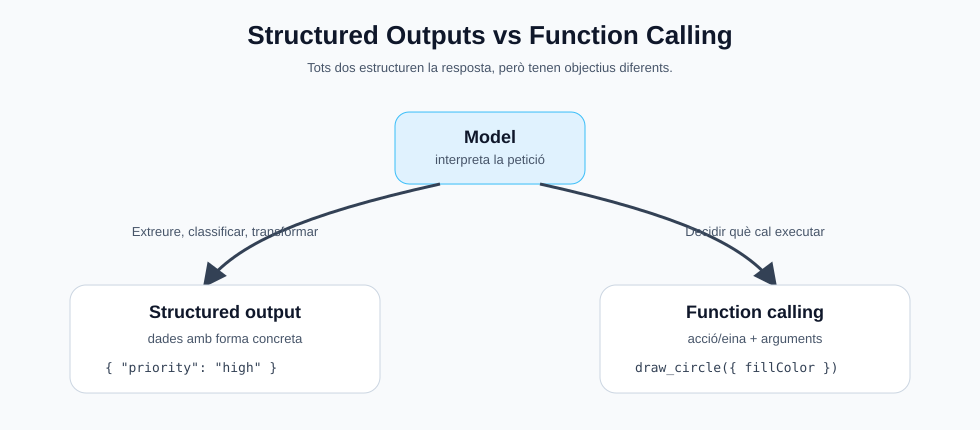

<style> .images { max-width: 960px; width: 100%; border: 1px solid grey; padding: 4px; margin-bottom: 25px; } </style>

# Function Calling

El **function calling** és una tècnica que permet que un model de llenguatge no es limiti a respondre amb text, sinó que triï una funció disponible i en generi els paràmetres en format estructurat.

La idea no és que el model executi codi directament. El model només decideix:

* quina funció s'hauria de cridar;
* amb quins arguments;
* en quin ordre, si cal fer més d'una acció.

Després és la nostra aplicació qui valida aquests arguments i executa la funció real.

A l'exemple "projecteFunctionCalling" ho fem servir per convertir ordres escrites en llenguatge natural en instruccions de dibuix sobre un `canvas`.

Per exemple, l'usuari pot escriure:

```text
dibuixa una estrella groga amb relleu blau marí
```

I el model pot retornar una crida estructurada com:

```json
{
  "name": "draw_star",
  "arguments": {
    "fillColor": "yellow",
    "strokeColor": "navy"
  }
}
```

El navegador no ha d'interpretar la frase original. Només ha d'executar una ordre clara: dibuixar una estrella amb un color de fons i un color de contorn.

---

## Per què és útil?

Sense function calling, una aplicació hauria d'analitzar text lliure:

```text
dibuixa un cercle verd al centre amb contorn lila de 3 píxels
```

Això obligaria a escriure un parser manual per detectar figures, colors, posicions, mides i excepcions lingüístiques. Amb function calling, deleguem aquesta interpretació al model, però amb un contracte molt concret.

El model no pot inventar qualsevol resposta. Li donem una llista de funcions disponibles i un esquema de paràmetres. Això redueix molt l'ambigüitat.

El flux general és:

```text
Usuari
  -> prompt natural
  -> model amb llista de funcions disponibles
  -> tool_calls estructurats
  -> servidor valida i normalitza
  -> client executa l'acció
```



---

## Structured Outputs

Abans de parlar de function calling, cal entendre una idea molt propera: els **structured outputs**.

Un structured output és una resposta del model que ha de seguir una forma concreta, normalment JSON. En lloc de demanar:

```text
Resumeix aquesta factura.
```

podem demanar:

```text
Extreu el número de factura, la data, el proveïdor i l'import total.
Retorna només JSON amb aquest format.
```

I esperar una resposta com:

```json
{
  "invoiceNumber": "F-2026-0142",
  "date": "2026-05-26",
  "supplier": "Example SL",
  "total": 183.4,
  "currency": "EUR"
}
```

La diferència principal és aquesta:

| Tècnica           | Objectiu |
| ----------------- | --- |
| Text lliure       | Obtenir una resposta natural per llegir |
| Structured output | Obtenir dades amb una forma concreta |
| Function calling  | Decidir quina acció o eina cal executar |



Els structured outputs són molt útils quan volem **extreure, classificar o transformar dades**, però no necessàriament executar una acció.

Exemples:

| Cas                          | Sortida esperada |
| ---------------------------- | --- |
| Extreure camps d'una factura | JSON amb data, import, proveïdor |
| Classificar un missatge      | JSON amb categoria i prioritat |
| Analitzar una incidència     | JSON amb resum, severitat i passos |
| Convertir text a estructura  | JSON validable per l'aplicació |

Un exemple de prompt seria:

```text
Return only valid JSON with this schema:

{
  "title": "string",
  "priority": "low | medium | high",
  "tags": ["string"],
  "needsHumanReview": true
}
```

I una resposta vàlida:

```json
{
  "title": "Login button does not respond",
  "priority": "high",
  "tags": ["frontend", "bug"],
  "needsHumanReview": false
}
```

Això encara s'ha de validar al servidor. Que el model digui que retorna JSON no garanteix que sempre sigui JSON correcte, ni que els valors siguin admissibles.

Per tant, el patró recomanat és:

```text
model
  -> JSON estructurat
  -> parseig
  -> validació
  -> normalització
  -> ús dins l'aplicació
```

La diferència amb function calling és que en structured outputs el model retorna directament dades. En function calling, el model retorna una proposta d'acció:

```text
Structured output:
  "aquest text és una incidència de prioritat alta"

Function calling:
  "cal cridar create_issue amb aquests arguments"
```

En molts sistemes reals es fan servir les dues coses:

* structured outputs per obtenir dades netes;
* function calling per decidir accions;
* validació del servidor en tots dos casos.

---

## Informar el model de les funcions disponibles

Quan fem una petició a un model compatible amb l'API d'OpenAI, podem enviar un camp `tools`. Aquest camp descriu les funcions que el model pot fer servir.

Cada eina acostuma a tenir:

| Camp                   | Funció |
| ---------------------- | --- |
| `type`                 | Normalment `"function"` |
| `function.name`        | Nom estable de la funció |
| `function.description` | Explicació de quan s'ha d'usar |
| `function.parameters`  | Esquema JSON dels arguments |

En el projecte `projecteFunctionCalling`, aquesta llista es construeix a `server/app.js` dins la constant `drawingTools`.

El codi del servidor no escriu tots els esquemes JSON a mà. Fa servir helpers per no repetir descripcions. Per exemple:

```js
tool("draw_line", "Draws a straight line on the canvas.", {
  x1: randomizableNumberProperty("Initial X coordinate in pixels."),
  y1: randomizableNumberProperty("Initial Y coordinate in pixels."),
  x2: randomizableNumberProperty("Final X coordinate in pixels."),
  y2: randomizableNumberProperty("Final Y coordinate in pixels."),
  color: cssColorProperty("Line color."),
  width: randomizableNumberProperty("Line width in pixels.")
})
```

El helper `randomizableNumberProperty(...)` genera un camp que accepta un número o el text `"random"`:

```js
function randomizableNumberProperty(prefix) {
  return {
    type: ["number", "string"],
    description: `${prefix} Use a number when the user provides a value. Use the exact string "random" when the user does not provide this value.`
  };
}
```

Per tant, el JSON conceptual que s'envia al model per a `draw_line` és de l'estil:

```json
{
  "type": "function",
  "function": {
    "name": "draw_line",
    "description": "Draws a straight line on the canvas.",
    "parameters": {
      "type": "object",
      "additionalProperties": false,
      "properties": {
        "x1": {
          "type": ["number", "string"],
          "description": "Initial X coordinate in pixels. Use a number when the user provides a value. Use the exact string \"random\" when the user does not provide this value."
        },
        "y1": {
          "type": ["number", "string"],
          "description": "Initial Y coordinate in pixels. Use a number when the user provides a value. Use the exact string \"random\" when the user does not provide this value."
        },
        "x2": {
          "type": ["number", "string"],
          "description": "Final X coordinate in pixels. Use a number when the user provides a value. Use the exact string \"random\" when the user does not provide this value."
        },
        "y2": {
          "type": ["number", "string"],
          "description": "Final Y coordinate in pixels. Use a number when the user provides a value. Use the exact string \"random\" when the user does not provide this value."
        },
        "color": {
          "type": "string",
          "description": "Line color. Must be a valid CSS color in English or hexadecimal, for example green, navy, lightgray, or #0f766e. Do not return non-English color names."
        },
        "width": {
          "type": ["number", "string"],
          "description": "Line width in pixels. Use a number when the user provides a value. Use the exact string \"random\" when the user does not provide this value."
        }
      },
      "required": []
    }
  }
}
```

Les funcions disponibles són:

| Funció | Acció |
| --- | --- |
| `draw_line` | Dibuixa una línia |
| `draw_circle` | Dibuixa un cercle |
| `draw_rectangle` | Dibuixa un rectangle |
| `draw_square` | Dibuixa un quadrat |
| `draw_oval` | Dibuixa un oval o el·lipse |
| `draw_triangle` | Dibuixa un triangle |
| `draw_star` | Dibuixa una estrella |
| `set_canvas_background` | Canvia el color de fons del canvas |
| `clear_canvas` | Neteja el canvas |

Els paràmetres numèrics accepten un número o el placeholder `"random"`. Si l'usuari no diu coordenades, mida o gruix, el model hauria de retornar `"random"` en aquell camp. Després el servidor substitueix `"random"` per valors aleatoris dins d'un rang vàlid.

---

## El prompt del sistema

A més de la llista de funcions, convé donar al model un **prompt de sistema** que expliqui les regles generals.

En aquest exemple, el prompt diu al model que:

* és un assistent de dibuix;
* l'usuari pot escriure en qualsevol idioma;
* primer ha de traduir i normalitzar internament la petició a l'anglès;
* ha d'usar function calling per dibuixar;
* el canvas fa `800x600` píxels;
* l'origen `(0,0)` és a la cantonada superior esquerra;
* si l'usuari demana el centre, ha d'usar `x=400` i `y=300`;
* si l'usuari no dona un valor numèric, ha de retornar `"random"` per a aquell argument;
* els colors dels arguments han de ser CSS vàlids en anglès o hexadecimal.

Aquest punt dels colors és important. L'usuari pot escriure:

```text
dibuixa un cercle verd amb relleu blau marí
```

Però el model hauria de retornar:

```json
{
  "fillColor": "green",
  "strokeColor": "navy"
}
```

No:

```json
{
  "fillColor": "verd",
  "strokeColor": "blau marí"
}
```

El servidor encara manté una normalització defensiva, però el contracte correcte és demanar al model que retorni valors ja normalitzats.

---

## Què s'espera com a resposta?

Quan el model decideix usar una funció, la resposta conté una llista de `tool_calls`.

Una petició simple pot generar una sola crida:

```text
dibuixa una línia verda de 50,75 fins a 200,300
```

Resposta esperada:

```json
{
  "tool_calls": [
    {
      "function": {
        "name": "draw_line",
        "arguments": {
          "x1": 50,
          "y1": 75,
          "x2": 200,
          "y2": 300,
          "color": "green",
          "width": "random"
        }
      }
    }
  ]
}
```

Una petició amb diverses figures pot generar diverses crides:

```text
dibuixa un cercle verd i una estrella groga amb contorn blau
```

Resposta esperada:

```json
{
  "tool_calls": [
    {
      "function": {
        "name": "draw_circle",
        "arguments": {
          "fillColor": "green",
          "x": "random",
          "y": "random",
          "radius": "random"
        }
      }
    },
    {
      "function": {
        "name": "draw_star",
        "arguments": {
          "fillColor": "yellow",
          "strokeColor": "blue",
          "x": "random",
          "y": "random",
          "outerRadius": "random"
        }
      }
    }
  ]
}
```

L'ordre de la llista importa. El client dibuixa les figures en el mateix ordre en què arriben.

---

## Normalitzar i validar

No s'ha d'executar cegament el que retorna el model. Encara que usem function calling, la resposta continua venint d'un model probabilístic.

Per això el servidor fa una fase de normalització:

```text
tool_call del model
  -> parseig dels arguments JSON
  -> comprovació del nom de funció
  -> conversió de colors
  -> valors per defecte o aleatoris
  -> ordre interna segura per al client
```

En el projecte, aquesta feina la fa la funció `normalizeToolCall(...)`.

Per exemple, si el model retorna:

```json
{
  "name": "draw_circle",
  "arguments": {
    "fillColor": "green",
    "x": "random",
    "y": "random",
    "radius": "random"
  }
}
```

El servidor ho pot convertir en:

```json
{
  "type": "circle",
  "x": 312,
  "y": 180,
  "radius": 82,
  "fillColor": "green",
  "strokeColor": "#111827",
  "strokeWidth": 4
}
```

Els camps `x`, `y`, `radius`, `strokeColor` i `strokeWidth` no venien del model. Els ha completat el servidor.

Això té dos avantatges:

* l'usuari pot fer ordres curtes, com `dibuixa una estrella vermella`;
* el client sempre rep una ordre completa i fàcil de dibuixar.

També es validen casos bàsics:

* si els arguments no són JSON vàlid, la crida s'ignora;
* si el nom de funció no és conegut, no s'executa;
* si falta un número, s'usa un valor segur;
* si un color arriba en català per error, `cssColor(...)` intenta convertir-lo.

La normalització defensiva no substitueix el prompt. El prompt intenta que el model retorni bons arguments; la normalització protegeix l'aplicació quan això no passa.

---

## Implementació de l'exemple

El projecte està a:

```text
projecteFunctionCalling
```

S'arrenca amb:

```bash
cd projecteFunctionCalling
npm run dev
```

La web funciona al port `3000`.

La configuració del model local és a:

```text
projecteFunctionCalling/settings.env
```

Exemple:

```env
PORT=3000
VLLM_BASE_URL=http://127.0.0.1:8002/v1
VLLM_API_KEY=local
VLLM_MODEL=gemma4-8b-local
VLLM_TIMEOUT_MS=900000
MAX_TOKENS=700
TEMPERATURE=0.1
```

El servidor Express és a:

```text
projecteFunctionCalling/server/app.js
```

La part important és la crida al servidor vLLM compatible amb OpenAI:

```js
const response = await fetch(`${VLLM_BASE_URL}/chat/completions`, {
  method: "POST",
  headers: {
    "Content-Type": "application/json",
    Authorization: `Bearer ${VLLM_API_KEY}`
  },
  body: JSON.stringify({
    model: VLLM_MODEL,
    messages,
    tools: drawingTools,
    tool_choice: "auto",
    temperature: TEMPERATURE,
    max_tokens: MAX_TOKENS
  })
});
```

Els elements clau són:

| Camp | Funció |
| --- | --- |
| `messages` | Inclou el prompt del sistema, l'historial i el missatge de l'usuari |
| `tools` | Llista de funcions disponibles |
| `tool_choice: "auto"` | Deixa que el model decideixi si cal usar funcions |
| `model` | Nom del model local servit per vLLM |

Quan arriba la resposta, el servidor extreu:

```js
const assistantMessage = completion?.choices?.[0]?.message || {};
const toolCalls = Array.isArray(assistantMessage.tool_calls) ? assistantMessage.tool_calls : [];
```

Després prepara dues coses:

```js
const modelToolCalls = toolCalls.map(formatModelToolCall).filter(Boolean);
const commands = toolCalls.map(normalizeToolCall).filter(Boolean);
```

`modelToolCalls` serveix per mostrar a la web el que ha retornat literalment el model: funció i arguments.

`commands` és el que el client realment executa després de validar i completar dades.

La resposta que el servidor envia al navegador té aquesta forma:

```json
{
  "reply": "Fet: cercle, estrella.",
  "commands": [
    {
      "type": "circle",
      "x": 312,
      "y": 180,
      "radius": 82,
      "fillColor": "green",
      "strokeColor": "#111827",
      "strokeWidth": 4
    }
  ],
  "modelToolCalls": [
    {
      "name": "draw_circle",
      "arguments": {
        "fillColor": "green"
      }
    }
  ]
}
```

---

## El client web

El client és a:

```text
projecteFunctionCalling/server/public/app.js
```

Quan rep la resposta del servidor, recorre les ordres normalitzades:

```js
for (const command of payload.commands || []) {
  applyCommand(command);
}
```

`applyCommand(...)` decideix quina funció de dibuix del navegador cal cridar:

```text
line       -> drawLine
circle     -> drawCircle
rectangle  -> drawRectangle
square     -> drawSquare
oval       -> drawOval
triangle   -> drawTriangle
star       -> drawStar
background -> setCanvasBackground
clear      -> clearCanvas
```

També mostra un quadre gris amb la traça del function calling:

```text
Funcio: draw_star
{
  "fillColor": "yellow",
  "strokeColor": "navy"
}
```

Això no és la cadena de pensament del model. És una traça observable i segura:

* quina funció ha triat;
* quins arguments ha retornat;
* què ha rebut el servidor abans de normalitzar.

És molt útil per ensenyar function calling perquè permet veure la diferència entre:

* la frase de l'usuari;
* la crida estructurada del model;
* l'ordre normalitzada que finalment executa el client.

---

## Bones pràctiques

Algunes idees importants quan es treballa amb function calling:

* Les funcions han de tenir noms clars i estables.
* Les descripcions han d'explicar quan usar cada funció.
* Els paràmetres han de tenir tipus concrets.
* Els valors lliures, com colors o unitats, s'han de normalitzar.
* No s'ha de confiar cegament en el model.
* El servidor ha de validar noms de funció i arguments.
* És útil mostrar traces de debug durant l'aprenentatge.
* Si el model local no segueix bé el contracte, cal reforçar prompt, schema i normalització.

Function calling no elimina la necessitat de programar la lògica de negoci. El que fa és convertir llenguatge natural en una interfície estructurada que el nostre codi pot validar i executar.
